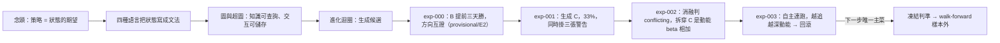

# 從一個念頭，到一台會拒絕相信自己的引擎

這一頁用一條敘事線把整個系統串起來：一個關於「策略到底是什麼」的念頭，怎麼長成四種語言、一層圖記憶、一台會自我否證的進化引擎。讀完你會知道每一塊在哪一頁展開，以及**為什麼這台引擎最值得看的能力，是它拒絕相信自己剛生出來的漂亮結果**。

## 第一步：策略不是「條件 → 動作」，是「狀態 → 期望」

傳統做法把策略想成「一堆 if/else 規則」。這裡的第一原理不同：

> 策略的本質是**對狀態的期望**。「某檔股票符合某些條件」＝它現在的狀態 S；「未來很可能大漲」＝對這個狀態的期望值 `E[未來報酬 | S]`；回測的作用，是提高這個期望的**證據等級**。

這個定義把策略拆成一條可分工的流水線：

```
世界狀態 State → E[未來報酬 | S] → 依期望值排序 → 政策 Policy → 投資組合
```

直接的推論是：**機器學習只做一件事——估計條件期望值**。池怎麼篩、事件何時觸發、多久換一次股、資金怎麼配，全是政策層，不該塞進模型。過去「機器學習好像做不到這麼複雜」的困惑，來自把 Alpha（估期望）和 Policy（怎麼行動）混在一起。

還有一個容易被忽略、卻是整套設計地基的判斷：**樣本單位是「決策事件」，不是「一天」**。owner 的真實策略是等月營收公布日才重新排名選股——7/10 公布六月營收那天才有一筆決策，下一筆是 8/10，中間那些天根本不存在決策。硬把它塞成「一天一列」的日頻樣本，只會稀釋訊號、汙染標籤。這條「決策事件樣本」紅線貫穿所有實驗，細節見 [方法：策略基因（StrategySpec 九部件）](method-strategy-spec.md) 與 [詞彙表](glossary.md)。

## 第二步：四種語言，把「狀態」寫成可執行的文法

要讓 LLM 能生成合法策略、讓每句話唯一編譯成程式、讓結果可被否證與累積，「狀態」不能是一串自然語言，得是一套有型別、可組合、可驗證的語言。量化這一側由四層語言承載（[量化結構組成語言（總覽）](lang-quant.md) 是它們的合流總覽）：

- [特徵代數](fw-feature-algebra.md)：把每個特徵拆成完整地址 `B+X+W+R+O`（原始輸入 + 轉換算子鏈 + 窗口 + 比較基準 + 輸出型別）。關鍵洞察是「L 抽象層只描述深度，真正區分特徵靠 X 轉換」——創新高、移動平均、報酬率可能同屬 L1，但機制完全不同。這是策略基因的**文法層**。
- [世界訊號](fw-world-signal.md)：把世界事件、機制、公司在供應鏈的位置拆成可反證的世界模型，輸出的不是「會漲／不會漲」，而是行情演化的**九態**狀態機（甜蜜點／主升段／破壞……）。
- [持有期生命週期](fw-holding-lifecycle.md)：月頻選股「入選之後、到下次換股之間怎麼抱」的持有管理層，用退出狀態機 **H0–H5** 取代「固定提前三天賣」這種單一規則。
- [研究雙語](fw-research-bilingual.md)：證據級 **E0–E4**（沒回測＝E0 想法，樣本內＝E1，樣本外確認＝E3）、多維結果向量、以及把研究規格編譯成人類固定順序報告的認知編譯器。

再往上還有一層 [時間層](fw-temporal.md)：把時間從「欄位」升級為「圖的一級結構」，區分世界發生／資訊發布／可交易／入庫四種時間，混淆任一就是未來函數。這層目前**大部分還是設計，尚未實作**（見該頁誠實邊界）。

質化這一側是另一套語言（[質化結構組成語言（總覽）](lang-qual.md)）：新聞不拿來直接篩股票，而是拆成四層用法——理解（我到底買了什麼）→ 世界模型（事件影響誰、供應鏈圖）→ 研究（新聞這時才變成一組可反證特徵，過同一套證據閘）→ Alpha 工廠（假說 → 事件研究 → 演化）。三階段嚴格分離、禁止「新聞情緒分數」直接當特徵，落地雛形是 [質化引擎](fw-qual-engine.md)。

## 第三步：圖與超圖，讓知識可查詢、讓交互作用有地方存

有了語言還不夠。如果實驗結果只存成「單親字串鏈」，很多問題答不出來：這個特徵哪些策略用過？哪些組合反覆失敗、共同包含什麼？A 和 B 各自有效但從沒共測過嗎？尤其「創新高＋營收加速＋低波動」三者同現才強、單獨都弱——這種**高階交互作用**，二元邊根本存不下。

所以記憶結構升級成圖：

- [四張圖](graph-knowledge.md)：定義圖（特徵怎麼算出來）／策略圖（特徵怎麼組成持股）／證據圖（主張有什麼證據）／演化圖（誰生了誰、哪種變異在什麼條件有效）。**第一鐵律：圖是帳的投影，不是第二真相源**——DROP 掉全部圖，從 append-only 帳重推必須逐位元一致；沒有證據列的邊不准存在。
- [超圖](graph-hypergraph.md)：二元邊存「可分解的已知關係」，超邊存「多條件共同作用」。每份策略規格就是一條**策略基因超邊**（它的內容雜湊 `genome` 同時當查重閘）；而**交互超邊**存已被消融驗證的高階綜效知識，成立條件極嚴（見下一步）。

## 第四步：進化迴圈——生成即拒絕相信

把語言當基因、把 AARO 實驗室當工廠、把市場當裁判，就構成進化迴圈（[方法：進化迴圈（圖提案→變異→裁決→回流）](method-evolution-loop.md) 六步、[方法：證據閘（十道關卡）](method-gates.md) 十道閘）。它的核心信條不是「一直找到更高 Sharpe」，而是：**每一次變異都能被嚴格歸因、驗證與記憶**。沒有這件事，系統只是在大量回測；有了才是在進化。

這台引擎真的轉了四輪，而它最該被記住的行為，是**一邊生成、一邊拒絕相信自己**：

- [實驗 000](exp-000-engine-first-run.md)：把 owner 現行月營收策略寫成「創世基因」入帳，只改退出時點生出子代——策略 B（提前三天賣）全樣本大勝 A（CAGR 20.22% vs 12.25%、Sharpe 1.083 vs 0.664、10/12 年勝），且與一條完全獨立的 finlab 管線**方向互證**。但引擎立刻掛三個限定：全樣本無 walk-forward、證據級封頂 **E2**、兩管線量值差 7 倍且最大回撤方向相反——所以裁決 **provisional**，只到「方向」為止，不改真錢。
- [實驗 001](exp-001-candidate-c.md)：用框架生成第一條新策略 C（月營收 × 250 日價格強勢），結果驚人地好（CAGR 33.22%、Sharpe 1.52、11/12 年勝，濾網越嚴報酬越高的乾淨單調）。但**這份報告真正的價值不是那個 33%，是框架當場給它掛三張警告標籤**：越嚴越好正是「動能 beta 在多頭樣本剛好付錢」的指紋、MDD 脆弱、籃子被換掉約一半（重疊只有 10.14/20）卻對持股強勢平均效果微弱——這是過擬合的常見長相。

## 第五步：消融自我否證——機器拆穿了自己最好的結果

生成一個漂亮結果、口頭警告它可疑，還不夠硬。真正把 C 拆穿的是消融：

- [實驗 002](exp-002-ablation.md)：對 C 跑乾淨的 **2×2 消融**（都沒有／只有營收／只有強勢／兩者都有），純碼判定關係為 **`conflicting`**——C 的優勢幾乎全是動能 beta 相加，不是綜效。證據硬到不留情面：純動能自己的 Sharpe 就已經 1.52，和「營收＋強勢」的 1.52 一模一樣；把強勢加到營收股上的增益（+13.0pp），和加到隨便一個基準上的增益（+12.3pp）幾乎一樣大——強勢的貢獻與有沒有做營收選股無關，是**相加不是綜效**。這條 `conflicting` 交互超邊永久留在正典帳。
- [實驗 003](exp-003-graph-evolution.md)：讓圖自己提案下一代、自主連跑三代。迴圈確實會轉（決定性可重現、每代父代是上一代、其中一代被否決並寫進 `closed_frontier` 不再重試）。但放手讓它追報酬，它就一路走進更純的動能暴露（某代 Sharpe 衝到 2.06）——因為在這段多頭樣本裡，動能就是會付錢。每一代都被如實封頂 provisional、標「幾乎肯定過度擬合」，沒有一代被誤判為可部署。這些世代在驗證後被**外科回滾**，正典帳保持乾淨的 A/B/C。



## 這台引擎現在到底處於什麼狀態

一句話：**機件會轉、帳務可信、能自我否證，但沒有任何一條策略撐過樣本外**。所有結論封頂在 E2，決策全部 provisional，真錢一律不動。這不是失敗，是**誠實成功**——系統的價值不在於已經找到 Alpha，而在於它有權拒絕相信自己的假發現。這套誠實紀律的完整條文在 [方法論：誠實紀律（拒絕相信自己）](discipline.md)，而我最希望你去攻擊的接縫（動能 beta 是否還有別的過擬合藏著、封閉詞彙的代價、圖邊的選擇性引用、自我一致 ≠ 樣本外有效）整理在 [給 LLM 評審：請攻擊這些接縫](for-llm-review.md)。

想看它怎麼被拼起來、資料怎麼流，接著讀 [整體架構與資料流](architecture.md)。

---

**被連結自（反向連結）：** [實驗索引：每一輪真跑，逐環節攤開](exp-index.md) · [整體架構與資料流](architecture.md) · [框架：持有期生命週期](fw-holding-lifecycle.md) · [框架：研究雙語與認知編譯器](fw-research-bilingual.md) · [給 LLM 評審：請攻擊這些接縫](for-llm-review.md) · [詞彙表](glossary.md) · [量化結構組成語言（總覽）](lang-quant.md) · [首頁：Alpha 進化迴圈研究 Wiki](index.md)
