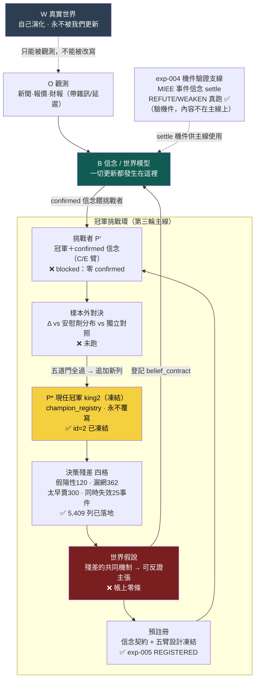

# 研究迴圈：世界不被更新、信念被更新，而主線繞著現任冠軍轉

這一頁畫整套系統**真正的主軸**，它疊了兩層修正。**第二輪批評**修位階：真實世界 W 永遠不被我們更新，被更新的只有信念 B——W（世界）／O（觀測）／B（信念）／P（策略）必須乾淨分離。**第三輪批評**修主線：就算 W/O/B/P 分乾淨了，先前的迴圈仍然**斷成兩段**——一段是 owner 真錢在跑的最強策略 king2（wiki 幾乎不談），一段是信念契約支線（[實驗 004](exp-004-belief-contract.md) 結算的兩條 MIEE 事件信念，跟任何真實決策無關）。認知迴圈自轉得再誠實，不接到「冠軍該不該改」就只是旁觀。**修法＝把主線釘在現任冠軍上：凍結冠軍 → 決策殘差 → 世界假說 → 預註冊 → 挑戰者 → 樣本外對決 → 晉升，整條環繞著「當前已知最好的決策政策」轉。**

> **認知答案**：研究迴圈的骨架仍是四物件分離——**W 真實世界**（自己演化、不被我們碰）、**O 觀測**（帶雜訊、不完整、延遲的讀數）、**B 信念**（一切被證據更新的都是它）、**P 策略**（信念穿過現實約束後的決策政策）。第三輪補上的是：P 不是一團流動的候選，**P 有一個被凍結的現任冠軍 P\***（king2），它是所有 Δ 的分母；認知迴圈（O→B→H→E→回B）的**輸入端從冠軍殘差長出**（冠軍上次錯在哪＝天然決策相關的未知），**輸出端以挑戰者對決收口**（confirmed 信念 → C/E 臂 → 樣本外對決 → 晉升追加新列）。
>
> **行動答案**：判斷任何工作屬於哪一段，先問它動的是 W、O、B、H、E、P，再問它在冠軍挑戰環的哪一步。**投資賺的仍是 surprise ＝ 新觀測 − 市場預期**，已定價的部分賺不到。目前冠軍挑戰環真的完成的是凍結（`champion_registry` id=2）、殘差（5,409 列）與預註冊（[實驗 005](exp-005-king2-prereg.md) REGISTERED）；**假說尚未從殘差長出、零臂已跑、零次對決**。exp-004 在這張圖上的正確位置是**支線**：它驗證了 settle 機件真的 fail-closed，但它的信念不來自冠軍殘差——機件是主線要用的，內容不是主線的。

## 一、主線全圖：W/O/B/P 骨架 × 冠軍挑戰環

讀圖三個要點：**①更新箭頭全部收在 B 上**——世界只有那條虛線的「被觀測」，沒有任何「被更新」；**②冠軍挑戰環是 P 層的正確形狀**——策略不是一團互相覆寫的候選，是「一個凍結在位者＋排隊的挑戰者」，晉升＝追加新列，歷史分母永存；**③exp-004 掛在環外**——它是機件驗證支線，證明 settle 真的 fail-closed（該推翻的推翻），主線之後長出的殘差假說要走的就是這套機件，但它自己的兩條信念（MIEE 漲價事件）不在冠軍的決策鏈上。

## 二、四個物件為什麼要分開：W ≠ O ≠ B ≠ P（第二輪，仍然成立）

| 物件 | 是什麼 | 誰會改變它 | 分不清會犯的錯 |
|---|---|---|---|
| **W 真實世界** | 利率、產能、供需、資金流的客觀狀態 | **只有 W 自己**；研究碰不到它 | 以為「研究成立＝改寫了世界」 |
| **O 觀測** | 對 W 的一次讀數：新聞、報價、財報 | 由 W 產生，帶雜訊、不完整、延遲 | 把 O 當 W：新聞說了就當世界如此 |
| **B 信念** | 內部對 W 的最佳估計（機制、因果邊、信心版本） | **只有證據**：新觀測、到期對帳 | 把 B 當 W：對自己的地圖過度自信 |
| **P 策略** | B 穿過成本／beta／風險約束後的決策政策 | 決策迴圈；**在位者 P\* 只能被晉升取代、不能被覆寫** | 把 P 當 B 的免費投影；或讓 P 被悄悄改動、失去分母 |

W 是地形，O 是會糊掉的照片，B 是你畫的地圖，P 是你據地圖規劃的路線——第三輪多釘一句：**路線裡有一條是你此刻真的在走的（P\*），研究的第一優先是搞懂這條路線上次在哪裡跌倒。**

同一則新聞仍是三種不同的東西（改變世界／揭露既有狀態／只改市場信念），你能賺的仍然只有 **surprise ＝ 新觀測 O − 市場預期 E_market[O]**——這兩節的完整展開見 [世界模型](world-model.md)，此處不重複。冠軍殘差正是 surprise 邏輯在決策層的鏡像：**殘差＝冠軍的實際決策結果 − 冠軍規則的隱含預期**，殘差最大的地方，就是冠軍的世界模型跟真實世界差得最遠的地方。

## 三、三迴圈疊在冠軍環上：各自的裁判不變，輸入輸出被接上了

[三個迴圈](three-loops.md)（認知／決策／元研究，各自裁判、永不混用）在第三輪沒有被推翻，而是**被接上了頭尾**：

| 迴圈 | 第二輪的樣子 | 第三輪接上冠軍環之後 |
|---|---|---|
| 元研究（選題） | ResearchValue 排序抽象未知——分子自估可 game | **殘差優先**：選題從冠軍殘差四格長出，決策相關性是歷史事實不是自估；ResearchValue 退為殘差外補充（見 [假說引擎：研究問題從冠軍的殘差長出來](hypothesis-engine.md)） |
| 認知（改信念） | 信念契約 settle——但信念內容與真實決策無關 | 殘差假說登記 belief_contract、前瞻對帳；**第一條 REINFORCE 就是 C 臂的解鎖鑰匙**——裁判仍是校準與反證，一字未變 |
| 決策（改策略） | 回測十閘裁決候選——但「更好」對誰比不明確 | **一切 Δ 以凍結冠軍為分母**；晉升要過五道門（樣本外增量、勝安慰劑分布、勝獨立對照、守門欄、人核）——裁判仍是 beta 中性後增量，但分母與門檻被制度化（見 [實驗 005：king2 冠軍—挑戰者五臂預註冊（REGISTERED，零臂已跑）](exp-005-king2-prereg.md)） |

## 四、逐節點誠實對帳：現在真的有資料在流嗎（2026-07-22）

| 節點 | 承載 | 現況 |
|---|---|---|
| **O 觀測** | [MIEE eventize](fw-qual-engine.md)（mcm 唯讀上游） | 有雛形：613 顆事件；新聞真歷史**僅 15 天** |
| **B 信念** | [知識層：一則新聞展開成一張知識子圖](knowledge-layer.md)／[因果層：新聞→事件→供需→公司→財報→預期→價格](causal-layer.md)／[信念契約](world-belief-contract.md) | 幾乎空殼：因果 edges 0 筆、信念僅 2 條真跑（皆負向：REFUTE／WEAKEN）、**confirmed＝0** |
| **H 假說** | [假說引擎](hypothesis-engine.md) | MIEE 有 3,412 筆前瞻預測帳；**從冠軍殘差長出的世界假說＝0 條** |
| **P\* 冠軍** | [champion_registry](champion-challenger.md) | ✅ **已凍結**（id=2，append-only 實打過，sha256 釘死） |
| **殘差** | `king2_residuals_dataset.parquet` | ✅ **已落地**：100 事件、5,409 列、四類計數＋具名案例（描述性分位口徑） |
| **預註冊** | [實驗 005](exp-005-king2-prereg.md) | ✅ REGISTERED：五臂＋五道門判準凍結、機件考卷 12/12；**零臂已跑** |
| **挑戰者／對決／晉升** | exp-005 C/E 臂→G1–G5 | ❌ C 臂 blocked（零 confirmed）、零對決、零晉升 |
| **E 對帳機件** | [信念 settle](world-belief-contract.md)／[十閘](method-gates.md) | 機件已由 exp-004 驗證 fail-closed；策略側 walk-forward 仍一輪未跑 |

一眼看懂：**冠軍環的地基三步（凍結、殘差、預註冊）是真的，中段（假說→confirmed→對決）整段是空的。** 這跟前兩輪「決策迴圈中段最肥、認知迴圈幾乎空」的診斷一致——第三輪沒有讓資料變多，它做的是把兩段敘事**接到同一條環上**，讓每個空格都有明確的下一步：下一步永遠是「從殘差長出第一條假說、settle 它」。

## 五、exp-004 的正確定位：機件驗證支線，不是主線第一格

前一版把 exp-004 稱為「分水嶺」，第三輪把這個定位修得更準：**它是認知迴圈的機件驗證支線。** 它證明的東西很真也很重要——信念可以預註冊、到期由純碼對帳、該推翻的真的被推翻（B-H-003 REFUTE 0.5→0.2256）、該削弱的只被削弱（B-H-001 WEAKEN 0.5→0.3913）、append-only 擋得住竄改。**主線之後的每一條殘差假說，走的都是這套機件。**但它不是主線本身：它的兩條信念來自 MIEE 漲價事件庫，不來自冠軍的任何一次決策；它們被推翻或削弱，冠軍一根汗毛都不會動。把「機件驗證成功」讀成「認知迴圈已接上決策」，正是第三輪批評點名的錯讀——機件是通用的，主線要的是**內容**（殘差長出的假說）流過這套機件。

## 六、誠實邊界（不得省略）

- **冠軍環七步只有①②④完成**（凍結、殘差、預註冊）；假說 0 條、confirmed 0 條、零臂已跑、零對決、零晉升。**不存在任何「世界信念已改善 king2」的證據**——那個命題目前連受試資格（C 臂解鎖）都還沒有。
- **殘差是描述性分位口徑**（p10／p90／p75），是研究線索的集合，不是因果結論。
- **認知側資料仍極薄**：新聞史 15 天、因果 edges 0 筆、世界狀態無逐日表——冠軍環給了認知側「該研究什麼」的準星，沒有變出資料。
- **冠軍是研究帳上的鏡像**，與真錢線有 9 條已知差異（記錄於 `engine/out/king2_residuals.json`）；真錢線對本研究帳唯讀，環上任何動詞都不自動觸及真錢。
- **策略側 walk-forward 仍未跑過**；exp-005 的 A 臂復算（Dev＋Val）會是第一次，官方口徑快照在那之前只是照抄。

一句話收束：**W/O/B/P 分離告訴你「什麼被更新」；冠軍挑戰環告訴你「繞著什麼更新」。** 前者第二輪修好了，後者第三輪剛把地基釘完——凍結的冠軍、落地的殘差、凍死的預註冊。下一步不是蓋更多環節，是讓第一條殘差假說真的走完「登記→對帳」，看它是成為第一把 C 臂鑰匙，還是誠實地死在 settle 上。

延伸：冠軍制度與殘差四格全貌見 [現任冠軍制度](champion-challenger.md)；五臂與晉升五道門見 [實驗 005](exp-005-king2-prereg.md)；殘差怎麼長成假說見 [假說引擎](hypothesis-engine.md)；settle 機件的真跑證據見 [實驗 004](exp-004-belief-contract.md) 與 [信念契約](world-belief-contract.md)；W/O/B 與 surprise 的完整論證見 [世界模型](world-model.md)；三迴圈裁判見 [三個迴圈](three-loops.md)；十一層架構與薄縱切紀律見 [研究作業系統](research-os.md)。

---

**被連結自（反向連結）：** [三個迴圈：認知、決策、元研究，各有各的裁判](three-loops.md) · [世界信念契約：被更新的是信念，不是世界](world-belief-contract.md) · [假說引擎：研究問題從冠軍的殘差長出來](hypothesis-engine.md) · [實驗 005：king2 冠軍—挑戰者五臂預註冊（REGISTERED，零臂已跑）](exp-005-king2-prereg.md) · [整體架構與資料流](architecture.md) · [演化的目標：一個目標函數量不了三種東西](objective.md) · [現任冠軍制度：凍結 king2，讓所有研究繞著真決策轉](champion-challenger.md) · [研究作業系統：11 層與「別蓋空引擎」](research-os.md) · [總覽：真正該演化的不是策略，是世界模型](overview.md) · [首頁：Alpha 進化迴圈研究 Wiki](index.md)
