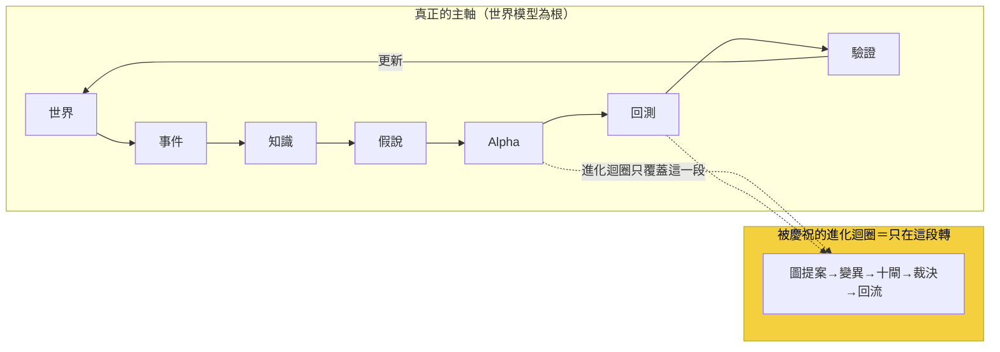

# 研究迴圈：策略只是其中一個節點，不是根

這一頁畫出整套系統**真正的主軸**。前面那些頁——[進化迴圈](method-evolution-loop.md)、[十道閘](method-gates.md)、各實驗頁——講的是「策略怎麼被生成、回測、裁決」。那些都對，但它們只是這條更大迴圈的**一小段下游**。owner 的重構要求把主軸講清楚：

> **認知答案**：研究迴圈的主軸是一個**以世界模型為根**的循環——**世界 → 事件 → 知識 → 假說 → Alpha → 回測 → Paper → 部署 → 交易 → 驗證 → 更新世界模型**。策略（Alpha）只是這條鏈上的**一個節點**，不是根；prompt、workflow、agent 這些東西全都是**工具**，不是被研究的對象。真正被研究、被演化的核心是那條最短的因果脊椎：**世界 → 知識 → 假說 → 驗證**。
>
> **行動答案**：判斷任何一項工作屬於研究還是雜務，就問它服務的是「世界→知識→假說→驗證」哪一段。目前這條迴圈**只有下游的一小段（Alpha→回測→驗證）真的有資料在流**，上游（世界→事件→知識→假說）幾乎是空的——所以下一步不是把下游優化得更漂亮，是把上游一條真鏈接起來（見 [研究作業系統](research-os.md) 的薄縱切）。

```mermaid
flowchart LR
    W["世界 World<br/>world-model · 機制與傳導"]
    E["事件 Event<br/>新聞抽取 · MIEE eventize"]
    K["知識 Knowledge<br/>knowledge-layer / causal-layer"]
    H["假說 Hypothesis<br/>hypothesis-engine · 預註冊凍結"]
    A["Alpha<br/>特徵→策略基因"]
    BT["回測 Backtest<br/>唯一評分器＋十閘"]
    PA["Paper<br/>模擬帳演習"]
    DP["部署 Deploy<br/>shadow / production"]
    TR["交易 Trade<br/>真錢永不自動"]
    VF["驗證 Verify<br/>settle 對帳 / walk-forward"]

    W --> E --> K --> H --> A --> BT --> PA --> DP --> TR --> VF
    VF -->|"更新世界模型"| W
    style W fill:#0f5c52,color:#fff
    style K fill:#20201a,color:#e08a8a
    style H fill:#20201a,color:#e08a8a
```

上圖用綠色標根（世界模型）、用暗色標**目前幾乎空殼**的兩段（知識、假說）。這張圖最重要的一件事，是那條從**驗證回到世界模型**的箭頭：一次研究的產出，最終要**改寫系統對世界怎麼運作的理解**，而不只是新增一條策略。這條回路目前幾乎沒有資料在流——那正是整台機器最大的缺口。

## 一、逐節點：這是什麼、誰承載、現在有沒有資料在流

| 節點 | 是什麼 | 誰承載 | 現在真的在流嗎 |
|---|---|---|---|
| **世界** | 對「什麼機制驅動什麼結果、怎麼傳導」的可反證理解 | [世界模型：世界不是新聞，新聞是世界狀態的 delta](world-model.md)（設計書第四部＋`wm_mirror` 六動詞鏡射） | **幾乎沒有**：正式 edges 表 0 筆、供應鏈僅一階 |
| **事件** | 從新聞抽出帶錨點引文的結構化事件 | [MIEE eventize](fw-qual-engine.md)（mcm 唯讀上游） | 有雛形：MIEE 613 顆事件；但新聞真歷史**僅 15 天** |
| **知識** | 事件→影響→傳導落成帶證據的圖與因果邊 | [知識層：一則新聞展開成一張知識子圖](knowledge-layer.md)／[因果層：新聞→事件→供需→公司→財報→預期→價格](causal-layer.md) | **幾乎空殼**：`causal_observations` 約 108 筆、正式因果 edges 0 筆 |
| **假說** | 從知識缺口提出**可反證**、預註冊凍結的假說 | [假說引擎：從「今天有哪些新聞」到「今天最大的未知是什麼」](hypothesis-engine.md)（MIEE 假說機為雛形） | 部分：MIEE 有 3,412 筆前瞻預測帳；策略側仍純碼枚舉 |
| **Alpha** | 把世界狀態寫成可組合的特徵與策略基因 | [特徵代數](fw-feature-algebra.md)→[策略基因](method-strategy-spec.md) | **在流**：特徵代數上線、DSL 六算子落地 |
| **回測** | 部署同形淨值引擎＋唯一評分器＋十閘 | [方法：證據閘（十道關卡）](method-gates.md)（AARO harness） | **在流**：四輪實驗真跑（[000](exp-000-engine-first-run.md)～[003](exp-003-graph-evolution.md)） |
| **Paper** | 畢業策略先進模擬帳演習，與真錢零耦合 | 框架書 paper-account | 有雛形：AARO 畢業策略可餵模擬帳；自動投遞未接 |
| **部署** | shadow → production 的權力階梯 | [人機權力表](discipline.md) | **未到**：全部封頂 provisional，無一升 supported |
| **交易** | 真實下單、成本、CA 閘 | 框架書執行層 | **未到**：真錢永不自動（人按 CA 閘是天然護欄） |
| **驗證** | 預測到期對帳、walk-forward 樣本外 | [MIEE settle](fw-qual-engine.md)／[walk-forward](method-gates.md) | 部分：MIEE 845 筆已對帳；策略側 **walk-forward 一輪都沒跑** |
| **更新世界模型** | 驗證結果回寫、改寫系統對世界的理解 | [wm_mirror 六動詞](world-model.md) | **幾乎沒有**：這條回路目前只鏡射裁決摘要，未改寫世界模型本身 |

一眼看懂這張表：**中段（Alpha→回測）是全機最成熟、資料最密的一段**——那也是為什麼過去所有漂亮成果都集中在這裡。但研究迴圈的**頭（世界→事件→知識→假說）和尾（驗證→更新世界模型）幾乎是空的**。系統很會生成與回測策略，卻幾乎不會「從世界長出假說」，也幾乎不會「把驗證結果回饋成對世界的新理解」。

## 二、prompt／workflow／agent 只是工具，不是被研究的對象

這條主軸還澄清了一個常見的位階混淆。做這套系統時，會用到大量 prompt、workflow、多 agent 編排——但**它們都是工具，不是研究的對象**。把 prompt 調得更好、把 workflow 串得更順，本身不產生任何 Alpha，也不改寫任何一條對世界的理解；它們只是讓「世界→知識→假說→驗證」這條脊椎跑得更省力的器械。

這一點直接呼應 [進化目標](objective.md) 那頁的病灶：如果把「被演化的東西」設成策略／程式／prompt，你就是在優化工具，不是在優化理解。AlphaEvolve 演化程式是對的，因為在它的場域裡**程式就是產品**；在量化裡，產品是**對市場的可反證理解**，prompt 和 workflow 只是通往它的路。判斷一項工作值不值得做，永遠回到那條脊椎——**它讓世界模型變得更能被反證地預測了嗎？還是只是把工具磨亮了？**

## 三、被慶祝的「進化迴圈」，其實只是這條主軸的下游片段

這是本頁對既有敘事最直接的修正。[進化迴圈](method-evolution-loop.md)那頁講的六步——Graph Retrieval → Gap Detection → Hyperedge Completion → Controlled Mutation → Experiment → Graph Writeback——是一個**很漂亮、機件也真的會轉**的閉環。但把它疊到上面那條主軸上就會看清楚：**它整個活在「Alpha → 回測 → 驗證」這一小段裡**。

它是策略層的一個**子迴圈**：在既定的特徵與規則空間裡，變異出下一條策略、回測、比父子、寫回。它完全**不碰**「世界→事件→知識→假說」這條上游——它的「Gap Detection」找的是**策略空間**的空洞（哪組因子沒共測過），不是**世界模型**的空洞（哪條傳導機制還沒被反證地理解）。這正是為什麼放手讓它跑，它只會在策略空間裡愈鑽愈深，最後鑽到動能 beta（[實驗 003](exp-003-graph-evolution.md)）——因為它的搜尋範圍裡，根本沒有「世界」這個維度。

所以「策略只是一個節點、不是根」不是修辭：**被當成整台引擎的進化迴圈，位階上只是主軸的一段下游子迴圈。** 把它誤當主軸，就會一直優化下游、永遠不碰上游。

## 四、誠實邊界（不得省略）

- **這條主軸目前只有中段真的在流**。世界、知識、假說（頭）與驗證、更新世界模型（尾）幾乎空殼——具體資料量：世界模型正式 edges 0 筆、因果觀察約 108 筆、供應鏈一階、新聞史 15 天、策略側 walk-forward 未跑、真錢未動。這些是 2026-07-22 快照，隨活管線浮動。
- **上游不是靠「多蓋幾個引擎」補起來**。把世界模型層、知識層、因果層各建一個空殼，正是 [研究作業系統](research-os.md) 警告的 architecture-first 陷阱。補法是薄縱切：挑**一條**真鏈（如台電強韌電網／CoWoS 擴產），讓資料真的從世界一路流到驗證、再回寫世界模型一次。
- **「更新世界模型」這條回路是最大缺口，也最難**。目前 `wm_mirror` 只把裁決摘要鏡射進世界模型基底，並**未真的改寫**系統對世界怎麼運作的理解。讓驗證結果回饋成新的因果邊、新的機制身份、新的時態超邊——那才是這條迴圈之所以叫「迴圈」的原因，而它現在幾乎是斷的。
- **既有實驗全部有效、但都在中段**。exp-000～003 的機件、消融、帳務都真跑且經獨立重算；本頁不改它們，只是把它們**定位回主軸的下游片段**，並指出頭尾兩端才是下一步。

一句話收束：**這台引擎很會走中間那段路（生成、回測、驗證策略），但研究迴圈的頭（從世界長出假說）和尾（把驗證寫回世界模型）幾乎還沒開始走。** 把主軸擺正、把目標換成世界模型的可反證預測力，然後用一條薄縱切把整條脊椎走通一次——這比把下游子迴圈再優化十遍都重要。

延伸：為什麼世界模型該當根、策略級目標為何會壞見 [進化目標](objective.md)；11 層架構與「別蓋空引擎」的紀律見 [研究作業系統](research-os.md)；世界模型層與因果層的真實空殼見 [世界模型：世界不是新聞，新聞是世界狀態的 delta](world-model.md)／[因果層：新聞→事件→供需→公司→財報→預期→價格](causal-layer.md)／[知識層：一則新聞展開成一張知識子圖](knowledge-layer.md)；把假說變成可反證一等公民見 [假說引擎](hypothesis-engine.md)；下游子迴圈的機件細節見 [進化迴圈](method-evolution-loop.md)；四輪真跑實驗見 [實驗索引](exp-index.md)。

---

**被連結自（反向連結）：** [假說引擎：從「今天有哪些新聞」到「今天最大的未知是什麼」](hypothesis-engine.md) · [整體架構與資料流](architecture.md) · [研究作業系統：11 層與「別蓋空引擎」](research-os.md) · [總覽：真正該演化的不是策略，是世界模型](overview.md) · [進化的目標設錯了（病灶六）](objective.md) · [首頁：Alpha 進化迴圈研究 Wiki](index.md)
