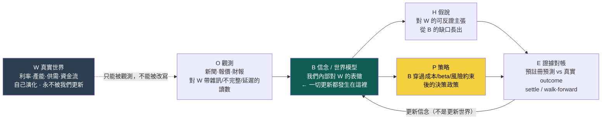
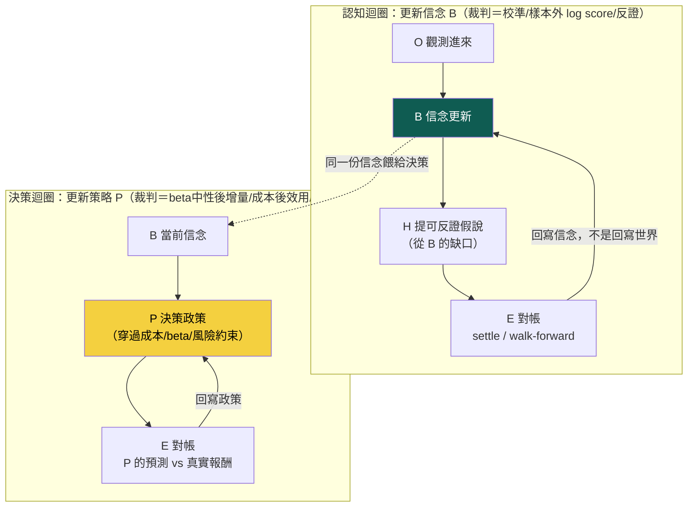

# 研究迴圈：真實世界不會被我們更新，被更新的是我們的信念

這一頁畫出整套系統**真正的主軸**。前面那些頁——[進化迴圈](method-evolution-loop.md)、[十道閘](method-gates.md)、各實驗頁——講的是「策略怎麼被生成、回測、裁決」。那些都對，但它們只是這條更大迴圈的**一小段下游**。

這一版還修掉了舊主軸的一個**位階錯誤**：舊圖把最後一步寫成「更新世界模型」，好像研究做完就去改寫世界。owner 第二輪批評把這件事挑明：**我們永遠不會更新真實世界，我們更新的只是自己對世界的信念。** 把「世界」和「信念」混成同一格，是這條迴圈長歪的起點。

> **認知答案**：研究迴圈要先把四個東西**徹底分開**——**W 真實世界**（自己演化、不被我們碰）、**O 觀測**（新聞、報價、財報這些對 W 的**帶雜訊、不完整、有延遲**的讀數）、**B 信念／世界模型**（我們**內部**對 W 的表徵，一切被證據更新的都是它）、**P 策略**（B 穿過真實世界約束後長出來的**決策政策**）。主軸是兩個扣在一起的迴圈：**認知迴圈** `O → B → H → E → 回 B`（觀測進來、更新信念、提可反證假說、對帳證據、再更新信念），與**決策迴圈** `B → P → E`（信念在成本／beta／風險約束下變成政策、政策下的預測再回去對帳）。W 坐在根，永遠只被它自己更新。
>
> **行動答案**：判斷任何一項工作屬於哪一段，就問它動的是 W、O、B、H、E 還是 P。**最重要的一句操作定義**：投資賺的不是「發生了什麼」，是 **surprise ＝ 新觀測 O − 市場預期 E_market[O]**——已經被定價進去的部分你賺不到。目前這條迴圈**只有 B→P→E 的下游中段真的有資料在流**，`O→B`（把觀測化成信念更新）與 `E→回B`（把對帳結果寫回信念）幾乎是空的——所以下一步不是把下游優化得更漂亮，是把「觀測→信念→對帳→回信念」這條認知迴圈用一條薄縱切接起來（見 [研究作業系統](research-os.md)）。三個迴圈為什麼要**分開裁決**，見 [三個迴圈](three-loops.md)；信念怎麼被證據逐版更新，見 [信念契約](world-belief-contract.md)。



這張圖最容易被忽略、卻是全頁樞紐的一筆，是 W 到 O 那條**虛線且單向**的箭頭：真實世界只能被我們觀測，不能被我們改寫。所有實線的「更新」箭頭都收在 B（信念）上。舊版把終點寫成「更新世界模型」時，把這條界線抹掉了——於是讀者會以為「研究成立＝世界變了」，其實研究成立只代表**我們對世界的信念，換了一個更能被反證預測的版本**。

## 一、四個物件為什麼一定要分開：W ≠ O ≠ B ≠ P

owner 這一刀砍的是一個到處都在犯、卻很難自己察覺的混淆：把「世界」「我看到的世界」「我以為的世界」「我因此要做的事」揉成一團。分開之後，很多原本說不清的事立刻清楚。

| 物件 | 是什麼 | 誰會改變它 | 分不清會犯的錯 |
|---|---|---|---|
| **W 真實世界** | 客觀狀態：利率、產能、供需、資金流。它此刻就是某個樣子 | **只有 W 自己**（政策、產線、天氣…）；我們的研究**碰不到它** | 以為「研究成立＝改寫了世界」——研究只改寫信念 |
| **O 觀測** | 對 W 的一次讀數：一則新聞、一筆報價、一份財報 | 由 W 產生，但帶**雜訊、不完整、延遲**——O 不等於 W | 把 O 當成 W 本身：新聞說了就當世界真的如此 |
| **B 信念／世界模型** | 我們**內部**對 W 的最佳估計（因果邊、機制、九態） | **證據**：新觀測、對帳結果。**這是唯一被更新的東西** | 把 B 當 W：對自己的信念過度自信，忘了它只是估計 |
| **P 策略** | B 在真實約束（成本、beta、風險、容量）下的**決策政策** | 決策迴圈：B 變了、或約束變了、或對帳說 P 沒增量 | 把 P 當 B 的免費投影，忽略約束那一層的真功夫（見 [演化的目標：一個目標函數量不了三種東西](objective.md)、[三個迴圈：認知、決策、元研究，各有各的裁判](three-loops.md)） |

一句話：**W 是地形，O 是你手上那張會糊掉的照片，B 是你據此畫的地圖，P 是你據地圖規劃的路線。** 你能改的只有地圖和路線；地形不因你重畫地圖而改變。這條區分不是哲學潔癖——它直接決定「一則新聞到底改變了什麼」，也直接決定「你到底能賺到什麼」。

## 二、一則新聞是三種完全不同的東西

把 W / O / B 分開後，最實用的結果是：**同樣一則新聞，可能在動三個不同的東西，而它們對投資的意義完全不同。** 這是 [世界模型](world-model.md) 那頁「新聞是狀態的 delta」的精確化——delta 打在哪一格，決定它值不值得交易。

| 新聞這則觀測，真正動的是… | 例子 | W 動了嗎 | B_market（市場信念）動了嗎 | 對投資的意義 |
|---|---|---|---|---|
| **① 改變世界狀態** | 台廠宣布 CoWoS 產能實際擴充、Fed 真的降息 | **動了**（真實產能／利率變了） | 通常也跟著動 | 世界真的走到新狀態，未來現金流的條件改變 |
| **② 揭露既有狀態** | 財報揭露上一季早已發生的營收；法說會確認先前傳聞 | 沒動（那個狀態上季就存在） | 動了（市場的估計往真相靠攏） | 你的**觀測**追上了 W；能否賺，看市場**先前信念**離真相多遠 |
| **③ 只改市場信念** | 分析師調評等、無實質的謠言、情緒性解讀 | 沒動 | 動了（集體信念偏移，價格跟著偏） | W 沒變、只有 B_market 變——這種偏移**會回歸**，是最危險也最常被當成訊號的一種 |

這張表為什麼要命？因為**價格動的是 B_market，不是 W**。三種新聞都可能讓價格跳，但它們的**持續性天差地別**：①有真實 W 撐著、②有真相錨定、③純信念偏移遲早回歸。一台把三者當成同一種「事件觸發」的引擎，會把第③種的雜訊當成第①種的訊號去追——這正是 [世界訊號](fw-world-signal.md) 要靠「機制身份＋反證必填」把它們分開的原因。

## 三、你賺的是 surprise，不是「發生了什麼」

四物件分開後最重要的一條操作結論：**投資的報酬來自 surprise，不來自事件本身。**

```
surprise ＝ 新觀測 O − 市場預期 E_market[O]
```

一則「營收年增 40%」的新聞，如果市場**早就預期** 45%，它是個**負** surprise，股價會跌——即使 40% 客觀上很好。反過來，市場預期 10%、實際 15%，這個「不算亮眼」的數字卻是正 surprise。**你賺到的永遠是「真實觀測減掉已經被定價進去的那部分」**，不是觀測的絕對水準。這就是為什麼 W / O / B 一定要分開：

- 只看 O（觀測絕對值）→ 你會追「好消息」，但好消息如果被超額定價，你買在山頂；
- 要算 surprise → 你必須同時握有 **O**（真發生什麼）和 **B_market**（市場先前信念／預期），surprise 是兩者的差。

這條直接對上 [世界訊號](fw-world-signal.md) 的「預期差（A，Anticipation）」欄，也對上 [質化引擎](fw-qual-engine.md) 的預測帳邏輯：預測帳記的不是「事件發生了沒」，是「事件相對於**事前預註冊的預期**，落在哪一邊、成本後還有沒有超額」。B-H-003 那條被推翻的信念（[信念契約](world-belief-contract.md)、[實驗 004](exp-004-belief-contract.md)）之所以能被真證據判 REFUTE，正因為它事前把預期（主窗 5 日、成本後正超額）**凍結**成一個可被 surprise 證偽的靶子——86 筆對帳只有 27 命中，surprise 系統性為負，信念就從 0.5 掉到 0.2256。

## 四、兩個迴圈扣在一起：認知迴圈更新 B，決策迴圈更新 P

把上面三節接起來，完整主軸是**兩個共用 E（證據對帳）、但更新不同東西的迴圈**：



兩個迴圈**共用同一份信念 B、共用同一套證據對帳 E，但各自更新不同的東西、各自被不同的裁判打分**。認知迴圈問「我對世界的理解更能被反證地預測了嗎」（裁判＝預測校準、樣本外 log score、反證）；決策迴圈問「在真實約束下，這條政策相對 beta 中性化後還有沒有增量」（裁判＝beta 中性後增量、成本後效用、風險）。把它們硬塞進**同一個**目標函數，就會發生 [進化目標](objective.md) 記錄的病：用策略級 Sharpe 一把尺量所有東西，最後只量出動能 beta。三個迴圈（還有一個管「怎麼選問題」的元研究迴圈）為什麼必須分開裁決，完整論證在 [三個迴圈](three-loops.md)。

## 五、逐節點：現在真的有資料在流嗎（誠實對帳）

| 節點 | 是什麼 | 誰承載 | 現在真的在流嗎 |
|---|---|---|---|
| **W 真實世界** | 客觀的利率／產能／供需狀態 | 外部世界（我們只能觀測） | 不適用——W 不是我們要「建」的東西，是我們要**觀測**的對象 |
| **O 觀測** | 從新聞抽出帶錨點引文的結構化觀測 | [MIEE eventize](fw-qual-engine.md)（mcm 唯讀上游） | 有雛形：MIEE 613 顆事件；但新聞真歷史**僅 15 天** |
| **B 信念** | 事件→影響→傳導落成帶證據的圖與因果邊，及其信心版本 | [知識層：一則新聞展開成一張知識子圖](knowledge-layer.md)／[因果層：新聞→事件→供需→公司→財報→預期→價格](causal-layer.md)／[信念契約](world-belief-contract.md) | **幾乎空殼**：`causal_observations` 約 108 筆、正式因果 edges 0 筆；信念契約僅 2 條真跑（B-H-001/003） |
| **H 假說** | 從 B 的缺口提出**可反證**、預註冊凍結的假說 | [假說引擎：今天最值得消除、又辨識得出的決策相關未知是什麼](hypothesis-engine.md)（MIEE 假說機為雛形） | 部分：MIEE 有 3,412 筆前瞻預測帳；策略側仍純碼枚舉 |
| **P 策略** | B 穿過約束後的決策政策（特徵→策略基因→組合→執行） | [特徵代數](fw-feature-algebra.md)→[策略基因](method-strategy-spec.md)→[十閘](method-gates.md) | **在流**：特徵代數上線、四輪實驗真跑（[000](exp-000-engine-first-run.md)～[003](exp-003-graph-evolution.md)） |
| **E 證據對帳** | 預測到期對帳、walk-forward 樣本外、信念 settle | [MIEE settle](fw-qual-engine.md)／[walk-forward](method-gates.md)／[信念 settle](world-belief-contract.md) | 部分：MIEE 845 筆已對帳、信念契約 2 條真 settle；策略側 **walk-forward 一輪都沒跑** |
| **回 B（更新信念）** | 對帳結果回寫成新的因果邊、機制身份、信心版本 | [信念契約六動詞](world-belief-contract.md)／[wm_mirror](world-model.md) | **剛起步**：exp-004 首次讓真證據把一條信念從 0.5 判到 0.2256（REFUTE），但只有 2 條 |

一眼看懂：**中段（P→E，也就是 Alpha→回測）是全機最成熟、資料最密的一段**——過去所有漂亮成果都集中在這裡。但研究迴圈的**認知側（O→B→H→E→回B）幾乎是空的**。系統很會生成與回測策略，卻幾乎不會「從觀測長出信念、再讓對帳把信念改版」。exp-004 的兩條信念契約是這條認知迴圈**第一次真的轉了一格**——珍貴，但也只有一格。

## 六、被慶祝的「進化迴圈」，只是決策迴圈裡的一小段

這是本頁對既有敘事最直接的修正。[進化迴圈](method-evolution-loop.md) 講的六步（Graph Retrieval → Gap Detection → Hyperedge Completion → Controlled Mutation → Experiment → Graph Writeback）是一個機件真會轉的閉環。但把它疊到主軸上就看清楚：**它整個活在「B → P → E」這條決策迴圈裡**，而且它的 Gap Detection 找的是**策略空間**的空洞（哪組因子沒共測過），不是**信念**的空洞（哪條傳導機制還沒被反證地理解）。它完全不碰認知迴圈的 `O→B→H`。這正是為什麼放手讓它跑，它只會在策略空間裡愈鑽愈深，最後鑽到動能 beta（[實驗 003](exp-003-graph-evolution.md)）——它的搜尋維度裡根本沒有「信念」這一軸。

所以「策略只是一個節點、不是根」不是修辭：**被當成整台引擎的進化迴圈，位階上只是決策迴圈的一段子迴圈。** 但要小心別矯枉過正到另一頭——策略**不是**可有可無的投影，它是信念穿過真實約束後的決策政策，有它**自己**該被獨立裁決的迴圈（見 [演化的目標：一個目標函數量不了三種東西](objective.md)、[三個迴圈：認知、決策、元研究，各有各的裁判](three-loops.md)）。

## 七、誠實邊界（不得省略）

- **認知迴圈目前幾乎是空的**。O→B→H→E→回B 這一整條，真實資料量：正式因果 edges 0 筆、因果觀察約 108 筆、信念契約僅 2 條、新聞史 15 天、策略側 walk-forward 未跑。這些是 2026-07-22 快照，隨活管線浮動。
- **「W 不被更新」是本頁的核心界線，但實作上我們連 W 的觀測都還很薄**。世界狀態（利率／美元／DRAM／CoWoS 稼動…）目前**沒有任何一張表逐日記錄**（見 [世界模型：世界不是新聞，新聞是世界狀態的 delta](world-model.md)）——我們不但沒在更新世界（本就不該），連對世界的觀測 O 都只有 15 天新聞這一條稀薄管道。
- **surprise 目前只在 MIEE 預測帳這一支真的算出來**。策略側的回測用的是絕對報酬對基準的超額，還沒有把「市場事前預期」當一級輸入去算 surprise——這是 [世界訊號](fw-world-signal.md) 預期差欄尚未接真資料的直接後果。
- **上游不是靠「多蓋幾個引擎」補起來**。把信念層、知識層、因果層各建一個空殼，正是 [研究作業系統](research-os.md) 警告的 architecture-first 陷阱。補法是薄縱切：挑**一條**真鏈（如 CoWoS 擴產、台電強韌電網），讓資料真的從觀測一路流到對帳、再回寫信念一次。
- **既有實驗全部有效、但都在決策迴圈中段**。exp-000～003 的機件、消融、帳務都真跑且經獨立重算；本頁不改它們，只是把它們**定位回主軸的一段下游**，並指出認知側才是下一步。exp-004 是唯一落在認知側的一次真跑。

一句話收束：**這台引擎很會走決策迴圈那段路（生成、回測、驗證策略），但認知迴圈（從觀測長出信念、讓對帳把信念改版）幾乎還沒開始走。** 把 W／O／B／P 擺開、把「更新」正確地收在信念上、用 surprise 取代「發生了什麼」當報酬來源，然後用一條薄縱切把認知迴圈走通一次——這比把決策子迴圈再優化十遍都重要。

延伸：三個迴圈為何要分開裁判、策略為何不是投影見 [三個迴圈](three-loops.md)；信念怎麼被證據逐版更新、B-H-003 怎麼從 0.5 被判到 0.2256 見 [信念契約](world-belief-contract.md) 與 [實驗 004](exp-004-belief-contract.md)；為什麼世界模型該當根、策略級目標為何會壞見 [進化目標](objective.md)；11 層架構與「別蓋空引擎」的紀律見 [研究作業系統](research-os.md)；世界／知識／因果層的真實空殼見 [世界模型：世界不是新聞，新聞是世界狀態的 delta](world-model.md)／[因果層：新聞→事件→供需→公司→財報→預期→價格](causal-layer.md)／[知識層：一則新聞展開成一張知識子圖](knowledge-layer.md)；把假說變成可反證一等公民見 [假說引擎](hypothesis-engine.md)；下游子迴圈的機件細節見 [進化迴圈](method-evolution-loop.md)。

---

**被連結自（反向連結）：** [三個迴圈：認知、決策、元研究，各有各的裁判](three-loops.md) · [世界信念契約：被更新的是信念，不是世界](world-belief-contract.md) · [假說引擎：今天最值得消除、又辨識得出的決策相關未知是什麼](hypothesis-engine.md) · [整體架構與資料流](architecture.md) · [演化的目標：一個目標函數量不了三種東西](objective.md) · [研究作業系統：11 層與「別蓋空引擎」](research-os.md) · [總覽：真正該演化的不是策略，是世界模型](overview.md) · [首頁：Alpha 進化迴圈研究 Wiki](index.md)
