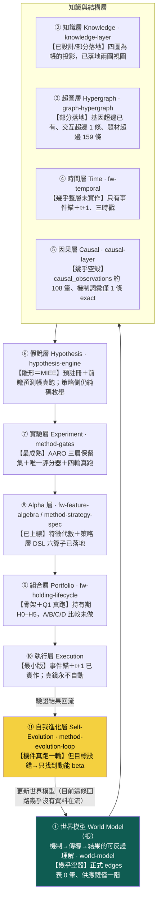
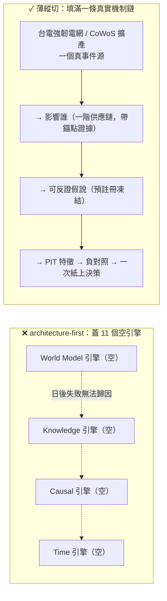

# 研究作業系統：11 層架構，與「別蓋 11 個空引擎」的紀律

這一頁把 owner 對整套系統的**結構重構**攤開：這不該是「一台進化策略的引擎」，而該是一個以**世界模型為根**的研究作業系統（Research OS），共 11 層——World Model／Knowledge／Hypergraph／Time／Causal／Hypothesis／Experiment／Alpha／Portfolio／Execution／Self-Evolution。

但這一頁同時要做一件**誠實對帳**的事，因為它最容易被誤讀成「所以我們要去把 11 層都蓋出來」。先給兩個答案：

> **認知答案**：11 層架構是對的**敘事與目標重構**——它把「策略」從研究的根，降級成迴圈裡的一個節點，把「世界模型」擺回根的位置（為什麼是根，見 [進化目標](objective.md) 與 [研究迴圈](research-loop.md)）。但這 11 層**目前的真實狀態**大多是「設計了、幾乎空殼、而且擺錯位階」，不是「已經蓋好」。
>
> **行動答案**：修法分兩半，**只做第一半是便宜且正確的，第二半必須忍住**。①**現在就重構敘事主軸與演化目標**——這只要改文件與評分方向，便宜、無風險、且直接對；②**建置仍走薄縱切**——先把**一條**真實的「世界→知識→假說→驗證」機制鏈填滿（例如台電強韌電網、或 CoWoS 擴產這種有真新聞、真傳導、真標的的鏈），**而不是把 11 個空引擎都蓋出來**。因為「真的把 11 層都蓋出來」正是 owner 自己在 [誠實紀律](discipline.md) 裡點名的 **architecture-first 致命陷阱**。

## 一、11 層各自是什麼、現在真的長什麼樣（三態對帳）

下面這張表是本頁的骨幹。每一層標三件事：**【已設計】**它在哪個既有頁或框架已被定義；**【幾乎空殼】**它實際的資料量／實作到哪；**這一層對應的頁**。誠實邊界不得省——owner 說「沒有 Knowledge／World State／Time／Causal Layer」，更精確的真相是「這些**設計了但幾乎是空殼、而且擺錯位階**」，不是完全沒有。

| 層 | 這一層做什麼 | 【已設計】 | 【幾乎空殼／真實資料量】 | 頁 |
|---|---|---|---|---|
| ① 世界模型 | 機制→產業→公司→供應鏈的可反證理解，是全迴圈的根 | 設計書第四部＋`wm_mirror` 六動詞鏡射介面 | **正式 edges 表 0 筆**；供應鏈只有一階（`supply_chain_distance` 幾乎全 0）；新聞真歷史僅 15 天 | [世界模型：世界不是新聞，新聞是世界狀態的 delta](world-model.md) |
| ② 知識 | 定義／策略／證據／演化四張圖，記「誰與誰有關、誰生了誰」 | [知識圖譜：四張圖](graph-knowledge.md) 第一鐵律「圖是帳的投影」 | 已落地演化圖／證據圖兩個 SQL 視圖；定義／策略圖為 spec 展開 partial | [知識層：一則新聞展開成一張知識子圖](knowledge-layer.md) |
| ③ 超圖 | 存「多條件共同作用」的高階交互 | [超圖：策略基因超邊與交互超邊](graph-hypergraph.md)（基因超邊＋交互超邊消融紀律） | 基因超邊已落地；交互超邊**只 1 條**（conflicting）；世界側題材超邊 `qual_hyperedge` 159 條 | [超圖：策略基因超邊與交互超邊](graph-hypergraph.md) |
| ④ 時間 | 把時間從欄位升級為圖的一級結構（四種時間／時態超邊／五時鐘） | [框架：時間層（時態邏輯節點）](fw-temporal.md)（十塊 schema 完整設計） | **幾乎整層未實作**；只有事件錨＋t+1、三時戳、`qual_edge` 時效欄 | [框架：時間層（時態邏輯節點）](fw-temporal.md) |
| ⑤ 因果 | 事件→影響→傳導的因果邊與機制身份 | [因果層：新聞→事件→供需→公司→財報→預期→價格](causal-layer.md)；mcm `causal_observations`＋MIEE `market_mapping` | `causal_observations` **約 108 筆**（活管線日更、浮動）；機制詞彙兩套僅 **1 條 exact 生效**、3 條待人核 | [因果層：新聞→事件→供需→公司→財報→預期→價格](causal-layer.md) |
| ⑥ 假說 | 從缺口提出**可反證**的假說，預註冊凍結 | [假說引擎：研究問題從冠軍的殘差長出來](hypothesis-engine.md)；MIEE 假說機（預註冊凍結＋落准觸發器） | MIEE 有 3,412 筆前瞻預測帳（真跑）；但**策略側**的「下一代測什麼」仍是純碼機制庫枚舉，非真假說引擎 | [假說引擎：研究問題從冠軍的殘差長出來](hypothesis-engine.md) |
| ⑦ 實驗 | 十道證據閘＋唯一評分器＋三層保留集，判真假 | [方法：證據閘（十道關卡）](method-gates.md)；AARO harness | **全機最成熟一層**：四輪實驗真跑、獨立重算、E2 封頂 | [方法：證據閘（十道關卡）](method-gates.md) |
| ⑧ Alpha | 把世界狀態寫成可組合的特徵與策略基因 | [框架：特徵代數](fw-feature-algebra.md)＋[方法：策略基因（StrategySpec 九部件）](method-strategy-spec.md) | 特徵代數已上線；策略層 DSL 六算子已落地 | [框架：特徵代數](fw-feature-algebra.md) |
| ⑨ 組合 | 入選之後怎麼抱到賣（持有管理） | [框架：持有期生命週期](fw-holding-lifecycle.md)（H0–H5＋剩餘 Alpha） | 骨架＋研究問題一真跑（finlab 覆核）；A/B/C/D 完整比較未做 | [框架：持有期生命週期](fw-holding-lifecycle.md) |
| ⑩ 執行 | 事件錨、t+1、成本滑價、真錢閘 | 框架書執行層；`engine/compile_positions` | 事件錨＋t+1 已實作；**真錢永不自動**（人按 CA 閘） | [研究迴圈：W/O/B/P 分離，主線繞著現任冠軍轉](research-loop.md) |
| ⑪ 自我進化 | 讓迴圈自己提案、變異、裁決、回流 | [方法：進化迴圈（圖提案→變異→裁決→回流）](method-evolution-loop.md)；evolution-loop 憲法 | 機件真跑一輪（[實驗 003](exp-003-graph-evolution.md)）；**但目標設錯→只找到動能 beta**（[演化的目標：一個目標函數量不了三種東西](objective.md)） | [方法：進化迴圈（圖提案→變異→裁決→回流）](method-evolution-loop.md) |

## 二、「擺錯位階」到底錯在哪

三態裡最隱形、也最該修的是第三態——**擺錯位階**。目前這份 wiki 的敘事骨架（[總覽](overview.md)／[架構](architecture.md)／[量化語言](lang-quant.md)）是**以策略為中心**排的：策略基因 → 語言棧 → 圖記憶 → 進化迴圈 → 實驗。世界模型（新聞、供應鏈、因果、時間）像是掛在旁邊的一組**側邊功能**（質化語言那一支），而不是整條研究迴圈的**根**。

這個排法本身就在複製病灶六。當敘事把「策略」放在中央，讀者、以及演化目標，都會自然地去優化「策略好不好」——於是就一路滑向 [實驗 002](exp-002-ablation.md) 那個結局：動能 beta。owner 的重構要求把位階倒過來：**世界模型是根，策略只是世界模型在某個決策時點的一個投影/下游節點**（見 [研究迴圈](research-loop.md) 的主軸）。這一步**不需要寫任何新引擎**，只需要重排敘事與重設目標——所以它是「便宜且正確」的第一半修法。

## 三、關鍵 caveat：別把「重構」做成「蓋 11 個空引擎」

這是全頁最重要的一句提醒，因為 11 層架構圖**太容易被讀成一張施工藍圖**。

owner 自己在 [誠實紀律](discipline.md) 的方向裁決裡，把 **architecture-first（架構先於價值驗證）** 列為**致命盲點**：四層同時建成，日後研究失敗就無法歸因到哪一層；精緻空轉。11 層比 4 層更危險——如果讀完這頁的反應是「那我們把 World Model、Knowledge、Causal、Time 四個空引擎都建起來」，那就正好踩進 owner 親手畫的地雷。

正確的第二半修法是**薄縱切**（thin vertical slice，[方法論：誠實紀律（拒絕相信自己）](discipline.md) 第六節）：

薄縱切的意思是：**先只打通一條**「真實事件源 → 影響誰 → 可反證假說 → PIT 特徵 → 負對照 → 持有規則 → 報告 → 一次紙上決策」的完整垂直鏈，讓這一條鏈**真的有資料在世界模型、知識、假說、驗證之間流動**。把 11 層各建一點點、卻沒有任何一條端到端跑通，是最差的結果——那是 11 個都是空殼，只是每個都「有了」。用一條真鏈把「世界→知識→假說→驗證」走通，遠比 11 個空引擎有價值，也才符合上位方向裁決的第一鐵律。

（為什麼選台電強韌電網 / CoWoS 這種鏈當第一條薄縱切：它們有真新聞、有可辨識的一階供應鏈、有可反證的傳導假說——正好是把因果層與世界模型層從「約 108 筆觀察／0 筆正式邊」推到「一條有證據的完整鏈」所需要的最小真實案例，而不是憑空畫想像的全圖。）

## 四、誠實邊界（不得省略）

- **本頁講的是結構重構，不是「已完成 11 層」**。表中每一層的【幾乎空殼】欄就是它的真實資料量：正式世界模型 edges 表 0 筆、因果觀察約 108 筆、供應鏈一階、交互超邊 1 條、時間層幾乎整層未實作、新聞史 15 天。這些數字是 2026-07-22 晨偵察快照，會隨活管線浮動。
- **11 層不是新蓋 11 個系統**。多數層是把**既有資產歸戶**進來：實驗層＝既有 AARO harness、Alpha 層＝既有特徵代數、組合層＝既有持有期、自我進化層＝既有進化迴圈。真正**近乎零實作**的是世界模型層、因果層、時間層，以及「策略側」的假說層。
- **第一半修法（重構敘事與目標）可以現在做；第二半（建置）必須走薄縱切**。把兩半混為一談、直接開工蓋四個空引擎，就是 architecture-first 復發。
- **11 層本身也在總體 kill criteria 之下**。若薄縱切跑完、A/B 記帳證明某層沒有增量，那一層照樣拆——把它蓋出來不構成保留它的理由（見 [方法論：誠實紀律（拒絕相信自己）](discipline.md) 第十節）。

一句話收束：**11 層是對的地圖，不是對的施工順序。** 現在就把世界模型擺回根、把目標從策略級績效換成世界模型的可反證預測力（[演化的目標：一個目標函數量不了三種東西](objective.md)）；然後只挑一條真鏈，把世界→知識→假說→驗證走通一次，再談要不要擴。

延伸：這條迴圈的完整主軸見 [研究迴圈](research-loop.md)；為什麼世界模型該當根、策略級目標為何會壞見 [進化目標](objective.md)；把假說變成可反證一等公民的機制見 [假說引擎](hypothesis-engine.md)；世界模型層與因果層的真實空殼狀態見 [世界模型：世界不是新聞，新聞是世界狀態的 delta](world-model.md) 與 [因果層：新聞→事件→供需→公司→財報→預期→價格](causal-layer.md)；architecture-first 與薄縱切的完整條文見 [誠實紀律](discipline.md)。

---

**被連結自（反向連結）：** [世界模型：世界不是新聞，新聞是世界狀態的 delta](world-model.md) · [因果層：新聞→事件→供需→公司→財報→預期→價格](causal-layer.md) · [整體架構與資料流](architecture.md) · [演化的目標：一個目標函數量不了三種東西](objective.md) · [知識層：一則新聞展開成一張知識子圖](knowledge-layer.md) · [研究迴圈：W/O/B/P 分離，主線繞著現任冠軍轉](research-loop.md) · [總覽：真正該演化的不是策略，是世界模型](overview.md) · [首頁：Alpha 進化迴圈研究 Wiki](index.md)
