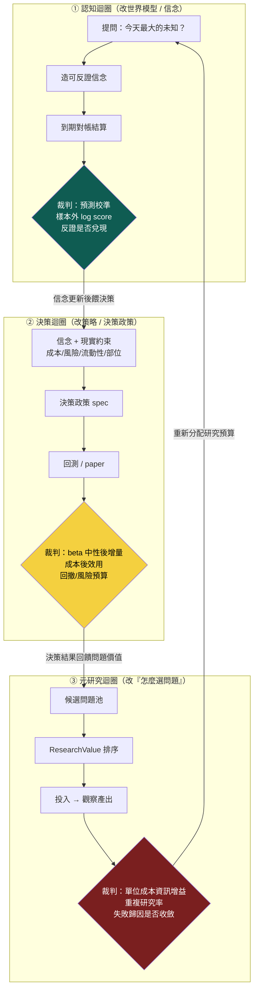

# 三個迴圈：認知、決策、元研究，各有各的裁判

這一頁修正 [進化目標](objective.md) 那頁可能被讀過頭的一句話。那頁說「該演化的是世界模型、不是策略」——這句話的**病灶診斷是對的**（優化策略級 Sharpe 只會重新發現動能 beta），但如果被讀成「**只**演化世界模型、策略是可有可無的投影」，就矯枉過正了。owner 的重構把它講清楚：不是把一個錯的單一目標換成另一個單一目標，而是**拆成三個分開裁決的迴圈**。

先給認知答案與行動答案。

> **認知答案**：一台會研究、會下注、又會改進自己的引擎，其實同時在跑**三個不同的迴圈**，各改一種東西、各用一套裁判，**絕不能共用同一個分數**：**認知迴圈**改世界模型（裁判＝預測校準／樣本外 log score／反證）、**決策迴圈**改策略（裁判＝beta 中性後的增量／成本後效用／風險）、**元研究迴圈**改「怎麼選問題」（裁判＝單位成本的資訊增益／重複研究率／失敗歸因）。策略**不是**世界模型的投影，而是「**世界信念進入現實約束（成本、風險、流動性、部位）後的決策政策**」——它是第一公民的決策迴圈，只是**不該用裸 Sharpe 當裁判**。
>
> **行動答案**：任何一項研究工作，先問它屬於哪個迴圈、該用哪個裁判驗收。用錯裁判是這台引擎最貴的錯——[進化目標](objective.md) 揭露的病，本質就是**拿「決策迴圈的裸績效」去當「認知迴圈的裁判」**：把「策略在樣本內賺多少」誤當成「世界模型多懂一分」。三個迴圈分家、各用各的裁判，這個誤用才會被結構性擋掉。



這張圖的重點是三個菱形（三套裁判）**顏色不同、內容不同**。三個迴圈會互相餵資料（認知更新完的信念餵決策、決策的結果回饋問題價值、元研究重新分配研究預算），但**驗收各自的成敗時，用的是各自的裁判，永不混用**。混用就是 [進化目標](objective.md) 那頁的病。

## 一、為什麼「只演化世界模型」是矯枉過正

[進化目標](objective.md) 的診斷沒錯：現行迴圈拿「子代策略級指標勝父代」當適應度，放手優化就一路滑進動能 beta（[實驗 002](exp-002-ablation.md) 判 conflicting、[實驗 003](exp-003-graph-evolution.md) gen3 Sharpe 衝到 2.06）。但那頁的**修法句**若被讀成「所以策略不重要、只要演化世界模型」，會掉進兩個坑：

- **策略被降格成投影，但投影不會下單**。世界信念再準，最終要**在成本、風險、流動性、部位限制下變成一個可執行的決策政策**才碰得到真錢。把策略當「世界模型的自動投影」，等於假設「懂了世界就自動會下對單」——這在有交易成本、有風險預算、有容量上限的現實裡是假的。決策本身是一個要獨立優化、獨立驗收的迴圈。
- **一個單一目標換成另一個單一目標，還是單一目標**。把「最大化 Sharpe」換成「最大化世界模型預測力」，仍然是**一個分數統治全局**。但「這條信念的預測準不準」跟「這個部位配置划不划算」跟「這個問題值不值得研究」，是三種**不可通約**的判斷。硬塞進一個分數，一定又有一個維度被另外兩個維度綁架——就像現在績效綁架了認知。

所以正解不是「只留一個迴圈」，是「**認清本來就有三個迴圈、把它們的裁判分開**」。[進化目標](objective.md) 抓對了病（裁判用錯層），這一頁補上完整的藥（三層各自的裁判）。

## 二、三迴圈分開裁決表：被改的東西 × 裁判 × 現況

| 迴圈 | 被改的東西 | 裁判（驗收標準） | 對映承載 | 現況（2026-07-22） |
|---|---|---|---|---|
| **① 認知迴圈** | 世界模型／信念（機制成不成立、信心多少） | **預測校準**、**樣本外 log score**、**反證是否兌現**——問「這條信念的可反證預測撐不撐得過未見資料」 | [信念契約](world-belief-contract.md)（到期對帳結算）／[假說引擎](hypothesis-engine.md)／[MIEE 預測帳](fw-qual-engine.md) | **首次真跑**：[實驗 004](exp-004-belief-contract.md) 兩條信念到期結算（REFUTE／WEAKEN）；但只到「信念更新」，未接下游 |
| **② 決策迴圈** | 策略／決策政策（選誰、抱多久、多大部位、何時退） | **beta 中性後的增量**、**成本後效用**、**風險預算/回撤**——問「扣掉能免費拿到的 beta，這個決策還多賺嗎、成本後划算嗎、風險吃得下嗎」 | [策略基因](method-strategy-spec.md)／[證據閘](method-gates.md)／[持有期生命週期](fw-holding-lifecycle.md) | **機件成熟但裁判待補**：回測/十閘/paper 都在跑，但**動能 beta 中性化尚未進適應度**（[實驗 003](exp-003-graph-evolution.md) 列為 P0） |
| **③ 元研究迴圈** | 「怎麼選問題」（研究預算往哪投） | **單位成本資訊增益**、**重複研究率**、**失敗歸因是否收斂**——問「今天這一份資源，消除了最多、最能被辨識的決策相關未知嗎」 | [假說引擎](hypothesis-engine.md) `research_gap`／`closed_frontier`／下節 ResearchValue | **殼有內容錯層**：缺口帳＋純碼排序＋死方向入帳都在，但排序準則仍是「策略調參優先級」，非 ResearchValue |

這張表把三件事一次講完：**三個迴圈都真實存在、都有承載、但都只做了一半**。認知迴圈剛跑出第一個真例（信念被真證據推翻）；決策迴圈機件最成熟卻還用著錯的裁判（裸績效，未做 beta 中性）；元研究迴圈的殼在、但裝的還是策略調參的優先級。

## 三、策略不是投影，是「信念進入現實約束後的決策政策」

這一節要把 owner 最容易被忽略的一句話講死：**策略是決策政策，不是世界模型的投影。** 兩者的差別在「約束」：

- **世界信念**回答的是 `E[未來報酬 | 世界狀態]`——一個對世界的**條件期望**，沒有成本、沒有部位上限、沒有風險預算。它是認知迴圈的產物。
- **決策政策**回答的是「**在有交易成本、有流動性上限、有風險預算、有既有部位的現實裡，此刻該對哪些標的、下多大單、抱多久、何時退**」。同一個世界信念，在不同成本結構、不同資金規模、不同風險胃納下，會投影出**完全不同**的決策政策。

換句話說，從信念到策略之間隔著一整層「現實約束」的最適化，那一層本身就是一個要獨立研究、獨立驗收的問題——它不是把信念「照抄」下來。這就是為什麼決策迴圈要有自己的裁判：**beta 中性後的增量**（扣掉市場免費給的 beta，這個決策政策還有沒有超額）、**成本後效用**（交易成本、衝擊成本吃完還剩多少）、**風險預算/回撤**（這個部位配置在最壞路徑上活不活得下來）。

用裸 Sharpe 當決策迴圈的裁判會壞，不是因為「策略不該被優化」，而是因為**裸 Sharpe 沒有扣掉 beta、沒有扣掉成本、沒有看風險路徑**——它把「這段多頭樣本免費發的動能 beta」算進了決策的功勞裡。[實驗 002](exp-002-ablation.md) 就是這件事的直接證據：純動能自己 Sharpe 1.52，等於「營收＋強勢」1.52，決策層的「綜效」是零。**這是「對現行目標函數存在動能捷徑」的直接實驗證據——不是「所有策略演化必然收斂到 beta」的證明。** 把裁判換成 beta 中性後增量，這條捷徑就被堵死，決策迴圈才會去找「beta 之外還多賺」的東西。

## 四、元研究迴圈：把「知識缺口收斂」換成防鑽漏洞的 ResearchValue

owner 對元研究迴圈的批評很尖：早期版本把目標寫成「知識缺口收斂」，這**會被鑽漏洞**——只要製造一堆容易收斂的假缺口、或把一個缺口拆成十個，「收斂速度」這個分數就能被灌水。正解是把「今天該研究什麼」換成一個**不能靠灌缺口刷分**的量：

```
ResearchValue = (Uncertainty × DecisionRelevance × Identifiability × ExpectedInfoGain)
                ─────────────────────────────────────────────────────────────────────
                                    (Cost × Time)
```

問題不再是「今天有哪些新聞」，也不是「今天缺口收斂了幾格」，而是：**「今天最值得花資源去消除、而且能被辨識、又和決策相關的未知是哪一個？」** 四個分子項各擋一種灌水：

- **Uncertainty（不確定性）**：這個未知現在的信心離 0.5 有多遠——已經很確定的事不值得再研究。
- **DecisionRelevance（決策相關性）**：解開它會不會**改變任何一個決策**——不會改變下單的知識再有趣也不投資源（防「刷有趣但沒用的缺口」）。
- **Identifiability（可辨識性）**：這個未知**能不能用現有資料被乾淨地識別**——識別不出來的問題，投再多資源也只會得到糊掉的答案（防「拆一堆識別不了的假缺口」）。
- **ExpectedInfoGain（期望資訊增益）**：一次實驗**期望能把信心移動多少**——移不動的問題不值得跑。

分母 `Cost × Time` 讓「貴且慢」的問題自動退位。而元研究迴圈的裁判——**單位成本資訊增益、重複研究率、失敗歸因是否收斂**——就是回頭驗收「ResearchValue 排得準不準」：如果重複研究率高（一直在撞同一個死方向）、或失敗歸因發散（每次失敗都歸到不同層、學不到東西），代表選問題的策略本身要改。這一層改的是「怎麼選問題」，不是「解某個問題」——它是[假說引擎](hypothesis-engine.md)的上位裁判。

## 五、三個裁判為什麼不能混用

把三套裁判並排，就看得出它們量的是**不可通約**的三件事，硬混一定出事：

```
認知迴圈裁判  →  量「信念準不準」   →  單位是 校準度 / log score / 反證兌現率
決策迴圈裁判  →  量「配置划不划算」 →  單位是 beta 中性後增量 / 成本後效用 / 回撤
元研究裁判    →  量「問題選得好不好」→ 單位是 單位成本資訊增益 / 重複率 / 歸因收斂
```

- **拿決策裁判去驗認知**（現行病）：世界模型的價值被「它讓某策略賺多少」綁架，結果引擎只會去找「這段樣本裡最會付錢的暴露」，也就是動能 beta——[進化目標](objective.md) 與 [實驗 002](exp-002-ablation.md) 的直接證據。
- **拿認知裁判去驗決策**：一條信念校準得再好，也不代表「照它下單、扣掉成本與 beta 後還賺」；預測準 ≠ 配置划算。
- **拿決策/認知裁判去驗元研究**：用「這次研究賺了多少/準不準」回頭定「該不該研究這個問題」，會讓引擎只敢碰穩賺的舊題、不碰高不確定但高價值的新題——正好扼殺研究最該做的探索。

所以三個迴圈分家的真正意義，是**讓每一種進步都用對它自己的尺**：世界模型用「可反證預測力」量、策略用「beta 中性後增量」量、選題用「單位成本資訊增益」量。這也是為什麼「只演化世界模型」不夠——你還需要另外兩把尺，去分別驗收另外兩種、無法被世界模型分數代表的進步。

## 六、誠實邊界（不得省略）

- **三個迴圈目前都只做了一半，且互相餵資料的箭頭幾乎沒接**。認知迴圈首次真跑（[實驗 004](exp-004-belief-contract.md)）只到「信念更新」，**沒有**把更新後的信念餵給決策迴圈；決策迴圈的 beta 中性裁判**尚未進適應度**；元研究迴圈的 ResearchValue **是設計、未落成排序器**。圖上三條互餵箭頭，目前大多是斷的。
- **裁判的具體算法多數還沒寫成程式**。「樣本外 log score」「beta 中性後增量」「單位成本資訊增益」現在是**方向與公式**，不是 `evolutor` 裡跑著的評分函式。唯一真跑成純碼的，是認知迴圈裡信念契約的 Wilson 下界結算（見 [信念契約](world-belief-contract.md)、[實驗 004](exp-004-belief-contract.md)）。
- **別把「三迴圈」當成「蓋三台大引擎」的許可**。把三個迴圈的裁判都做成完整系統，正是 [誠實紀律](discipline.md) 點名的 architecture-first 陷阱。修法仍是薄縱切：先把**認知迴圈**這一條（信念契約已跑出第一例）接到決策迴圈一次，證明「信念更新真的改變了一個決策」，再談另外兩個迴圈。先走通一條互餵，不要先擺三個空迴圈。
- **這是對 [進化目標](objective.md) 的補充，不是推翻**。那頁「別拿策略級績效當適應度」的診斷完全成立；本頁只是補上「那要換成什麼」——不是換成單一的世界模型目標，而是三個分家的裁判。兩頁一起讀才完整。

一句話收束：**這台引擎最貴的錯，是用決策迴圈的裸績效去當認知迴圈的裁判。** 把認知、決策、元研究三個迴圈分家，各用各的尺——世界模型用可反證預測力、策略用 beta 中性後增量、選題用單位成本資訊增益——「優化 Sharpe 卻以為在懂世界」這個誤用才會被結構性擋掉。

延伸：為什麼裸績效當適應度會壞見 [進化目標](objective.md)；整條世界→知識→假說→驗證主軸見 [研究迴圈](research-loop.md)；信念這一層怎麼被版本化結算見 [信念契約](world-belief-contract.md)；認知迴圈的第一個真例見 [實驗 004](exp-004-belief-contract.md)；決策迴圈的 beta 捷徑直接證據見 [實驗 002](exp-002-ablation.md)；選題器現況見 [假說引擎](hypothesis-engine.md)；為何不能一次蓋滿見 [誠實紀律](discipline.md)。

---

**被連結自（反向連結）：** [世界信念契約：被更新的是信念，不是世界](world-belief-contract.md) · [世界模型：世界不是新聞，新聞是世界狀態的 delta](world-model.md) · [假說引擎：今天最值得消除、又辨識得出的決策相關未知是什麼](hypothesis-engine.md) · [實驗 002：交互超邊消融](exp-002-ablation.md) · [實驗 004：世界信念契約首度到期對帳](exp-004-belief-contract.md) · [演化的目標：一個目標函數量不了三種東西](objective.md) · [研究迴圈：世界不被更新，被更新的是信念](research-loop.md) · [給 LLM 評審：請攻擊這些接縫](for-llm-review.md) · [首頁：Alpha 進化迴圈研究 Wiki](index.md)
