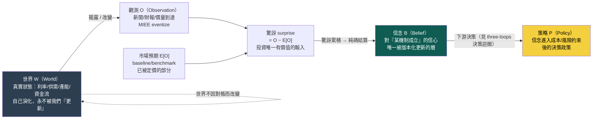
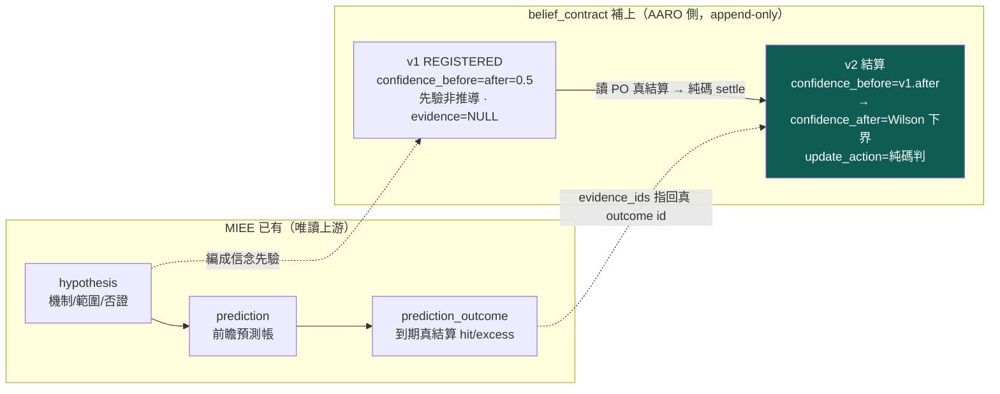

# 世界信念契約：被更新的是信念，不是世界

這一頁回答 owner 深層批評的第一點——**世界（World）、觀測（Observation）、信念（Belief）、策略（Policy）必須徹底分開**。前面幾頁（[世界模型](world-model.md)、[進化目標](objective.md)）已經把「世界是狀態、不是新聞流」講清楚，但還混著一個更根本的位階錯誤：把「更新世界」跟「更新信念」當成同一件事。它們不是。

先給認知答案與行動答案，其餘證據都服務這條主軸。

> **認知答案**：**真實世界永遠不會被我們「更新」**。一次 86 筆預測的到期對帳，改變的**不是世界怎麼運作**，而是**我們對某條機制的信心**——從 0.5 掉到 0.2256。會被版本化、被結算、被推翻的，只有**信念（B）**這一層；世界（W）自己演化、與我們的帳本無關，觀測（O）只是世界狀態的到達，策略（P）是信念進入成本與風險約束後的下游決策。投資裡唯一有價值的輸入，是**驚訝（surprise）＝新觀測 O − 市場預期 E[O]**；信念契約就是「把驚訝累積成對機制的信心、並純碼結算」的那張表。
>
> **行動答案**：任何一次實驗做完，都要能回答一個分水嶺問題——**「哪一條信念、因為哪一份證據、從哪一版更新到哪一版？」**。這不是修辭，是一張 append-only 表的五個欄位（`belief_id` × `version` × `confidence_before` → `confidence_after` × `evidence_ids` × `update_action`）就能答出的事實。真例已經跑出來了：見 [實驗 004](exp-004-belief-contract.md)，B-H-003 被 86 筆真證據推翻、B-H-001 被 636 筆削弱但存活。

這張圖最容易被讀漏的，是那條從 W 繞回 W 的虛線：**世界對帳完之後還是原來的世界。** 我們的帳本裡唯一動了的，是綠色那格「信念」的信心數字。把 W 跟 B 混在一起，就會犯「新聞一到、世界就變了、策略就該改」這種位階錯亂；分開之後，因果鏈才對得起來——世界改變或揭露 → 產生觀測 → 觀測減市場預期得到驚訝 → 驚訝累積更新信念 → 信念進約束變策略。

## 一、四層各是什麼、誰會動、誰不會動

owner 的分法可以逐層對到這台引擎現有（或該有）的承載點：

| 層 | 是什麼 | 誰承載 | 會不會被「更新」 |
|---|---|---|---|
| **世界 W** | 利率、美元、供需、產能、DRAM/HBM 循環、ETF 資金流等真實狀態變數 | [世界模型層](world-model.md)（目前近乎空殼） | **不會**：世界自己演化，我們的對帳不改變它 |
| **觀測 O** | 新聞、財報、價量等世界狀態的到達訊號 | [MIEE eventize](fw-qual-engine.md)（mcm 唯讀上游） | 不適用：O 只是「到達」，不是被更新的對象 |
| **信念 B** | 對「某條機制成立」的信心，帶適用範圍、否證條件、信心版本 | **本頁的 `belief_contract` 表** | **會，且只有它會**：append-only 一版一版更新 |
| **策略 P** | 把信念排序、加成本/風險約束後的下單政策 | [策略基因](method-strategy-spec.md)／[決策迴圈](three-loops.md) | 會，但由**另一個迴圈**、用**另一套裁判**改（見 [三個迴圈：認知、決策、元研究，各有各的裁判](three-loops.md)） |

一眼看懂這張表的重點：**只有「信念」這一層是信念契約負責版本化的對象**。世界不歸它管（歸 [世界模型：世界不是新聞，新聞是世界狀態的 delta](world-model.md)，而且世界不被「更新」），策略也不歸它管（歸 [決策迴圈](three-loops.md)，用 beta 中性後增量當裁判）。把三件事塞進同一個「進化」動作裡，正是 [進化目標](objective.md) 那頁揭露的病根；信念契約是把「信念更新」這一件事**單獨切出來、單獨結算**的機制。

## 二、一則新聞的三種身分：別把三件事混成「事件觸發」

owner 點名的第二個混淆：現行引擎把每一則新聞都當成「事件 → 觸發訊號 → 生策略」的同一種東西。但**一則觀測 O 至少有三種完全不同的身分**，對信念的作用天差地遠：

| 觀測的身分 | 例子 | 它動了哪一層 | 對信念 B 的作用 |
|---|---|---|---|
| **① 改變世界狀態** | Fed 真的降了一碼、台積電真的開出 CoWoS 新產能 | 動了 **W**（真實狀態變了） | 世界變了 → 未來觀測分佈改變；信念的**適用前提**可能要重畫 |
| **② 揭露既有狀態** | 財報公佈上季營收（營收早就發生，只是現在才被看到） | 沒動 W，只是 **O 讓既有 W 可見** | 這是最純的「驚訝」來源：O − 市場預期，直接餵信念結算 |
| **③ 只改市場信念** | 分析師喊目標價、傳聞、情緒 | 沒動 W，只動了**市場的 B**（不是我們的 B） | 改變的是 baseline 定價；我們要問的是「市場信念的移動有沒有 over/under 反應真實 W」 |

這三種身分不分清楚，就會把「世界變了」跟「別人以為世界變了」當成同一件事下注。信念契約的 `predicted_outcome` 欄刻意寫成 **`cost_adjusted_excess_return_vs_baseline`（相對 baseline 的成本後超額）**——因為 baseline（benchmark）就是「市場已經定價的預期 E[O]」，超額就是驚訝。信念在賭的從來不是「新聞說了什麼」，而是「**這則觀測相對市場預期的驚訝，會不會在預測方向上兌現**」。這正是 owner 那句「投資最重要的是 surprise」的資料結構化身。

## 三、14 欄信念契約 schema：一版信念的完整地址

一條信念的一個版本，就是 `belief_contract` 表的一列。除了 `(belief_id, version)` 這組 append-only 版本鍵，owner 設計的內容欄共 **14 欄**，每一欄都讓這條信念可被別的 LLM 逐欄稽核。下表用 [實驗 004](exp-004-belief-contract.md) 的真實信念 B-H-003（v2 對帳列）當具體例子，不是抽象 schema：

| # | 欄位 | 說明 | B-H-003 v2 真值 |
|---|---|---|---|
| 1 | `as_of` | 此信念狀態的截止時點（v1=假說誕生、v2=最後對帳日） | 2026-07-17 19:00:51 |
| 2 | `mechanism` | 因果機制（來自 MIEE `causal_mechanism`） | 漲價反映供需吃緊超出市場預期，未預先反應標的在事件後數日內遲滯重定價 |
| 3 | `scope` | 適用範圍：觸發事件＋進場條件＋主窗 | 觸發＝price_increase(min_conf 0.5)｜進場＝pre_event_runup_20d_max≤0.1｜主窗 5 日 |
| 4 | `antecedent` | 前件：什麼成立才觸發 | `{"pre_event_runup_20d_max":0.1}` |
| 5 | `predicted_outcome` | 預測後果：方向＋成本後超額（＝驚訝的操作化） | direction=positive、cost_adjusted_excess_return_vs_baseline、主窗 5 日 |
| 6 | `lag_distribution` | 時滯分佈：horizons＋主窗 | horizons=[5,10,20,60]，主窗 5 日 |
| 7 | `baseline` | 對照基準（＝市場已定價的預期 E[O]） | benchmark_index |
| 8 | `falsifier` | 否證條件（MIEE 原文，逐字保留） | 主窗成本後平均超額≤0，或 p_noise>0.05，或 n<20 判 insufficient |
| 9 | `confidence_before` | 更新前信心（v1＝先驗 0.5；v2＝v1 的 after） | 0.5 |
| 10 | `evidence_ids` | 證據指針：`prediction_outcome.id` 清單＋n/k | id 87..172、n=86、k=27 |
| 11 | `settlement_rule` | 純碼結算規則＋輸入（可據此重算 after） | wilson_lower_bound_95_vs_coinflip；wilson_lo=0.2256、hi=0.4182 |
| 12 | `confidence_after` | 更新後信心（純碼算：Wilson 95% 命中率下界） | **0.225612** |
| 13 | `update_action` | 更新動作（由規則決定，非人填） | **REFUTE** |
| 14 | `source_hypothesis` | 指回 MIEE（`miee:H-00x`） | miee:H-003 |

三件事讓這 14 欄不只是欄位，而是一條**可被否證、可被重算**的信念：

- **驚訝寫死在 5、7 兩欄**：`predicted_outcome`（超額）減 `baseline`（市場預期）就是驚訝；信念賭的是這個驚訝而非新聞本身。
- **否證寫死在 8 欄、且逐字保留 MIEE 原文**：一條信念沒有 `falsifier` 就不准入帳——這沿 [世界訊號](fw-world-signal.md) 的「反證必填」與 [誠實紀律](discipline.md)。
- **信心的移動（9→12）由 11 欄的純碼規則決定，13 欄記動作**：`confidence_after` 是命中率的 Wilson 95% 下界，`update_action` 由 `decide_action()` 決策樹判（見下節），**LLM 一個字都不進這兩欄**。

## 四、對照 MIEE：缺的從來不是預測，是「信心的版本化」

一個誠實的問題：這張信念表是不是重造輪子？不是。上游的 [MIEE](fw-qual-engine.md) 早就有一大半——它有 `hypothesis`（假說＝機制、範圍、否證）、`prediction`（前瞻預測帳）、`prediction_outcome`（到期真結算）。**MIEE 唯一沒有的，是把「同一條信念的信心怎麼隨證據一版一版變動」記成 append-only 的版本鏈。** 信念契約補的就是這一格。

版本鏈的紀律有三條，全部 append-only、全部純碼：

1. **v1 是先驗、不是推導**：註冊時 `confidence_before = confidence_after = 0.5`，`evidence_ids = NULL`，`update_action = REGISTERED`。0.5 是「方向擲硬幣」的無資訊基準，明說是先驗，不假裝從資料算出來。
2. **v2 的 before 鏈接 v1 的 after**：`confidence_before(v2) = confidence_after(v1)`，讓信心的移動是一條可追的鏈，不是憑空跳。
3. **改信念＝寫新版本，不改舊列**：表上有 `trg_belief_no_update` / `trg_belief_no_delete` 兩個觸發器，任何 UPDATE/DELETE 直接 `RAISE(ABORT)`。信念史只增不改——這樣「從哪版到哪版」永遠查得到。

`update_action` 的五種值由 `decide_action()` 決策樹純碼判定，對映 `falsifier` 的 OR 子句：

- `HOLD_PRIOR`：n < min_n，證據不足，維持先驗不更新；
- `REFUTE`：命中率 95% 上界仍不過 0.5 **且** 平均超額 ≤ 0（兩條否證子句齊發）→ 推翻；
- `REINFORCE`：命中率 95% 下界都過 0.5 **且** 超額 > 0 → 強化；
- `WEAKEN`：任一否證跡象（命中率 ≤ 0.5 或 超額 ≤ 0）→ 削弱但存活；
- `NARROW_SCOPE`：點估計過基準但不顯著 → 保留並限縮範圍待更多證據。

這五態就是「信念被證據怎麼對待」的完整詞彙。[實驗 004](exp-004-belief-contract.md) 一次就打出兩種：B-H-003 兩子句齊發判 REFUTE、B-H-001 只有命中率一側不過（超額仍正）判 WEAKEN——同一套規則、同一個機制、只差主窗與樣本，結局就從「推翻」變「削弱」。

## 五、分水嶺問題：實驗做完，能不能答出「哪條信念、因哪證據、從哪版到哪版」

這是整張表存在的理由，也是 owner 拿來驗收的那一句。把 [實驗 004](exp-004-belief-contract.md) 兩條信念的答案並排，就是這張表要交付的東西：

| 分水嶺問句 | B-H-003（推翻） | B-H-001（削弱） |
|---|---|---|
| 哪一條信念？ | B-H-003（機制：漲價超預期、遲滯重定價，主窗 5 日） | B-H-001（同機制，主窗 20 日） |
| 因為哪一份證據？ | `prediction_outcome` id 87..172 共 86 筆、命中 27（31.40%）、平均超額 −0.0076 | id 1..845 中 636 筆、命中 273（42.92%）、平均超額 +0.0018 |
| 從哪一版到哪一版？ | v1 → v2 | v1 → v2 |
| 信心怎麼變？ | 0.5 → **0.225612** | 0.5 → **0.391315** |
| 更新動作？ | **REFUTE**（wilson_hi 0.4182≤0.5 且 超額≤0，兩子句齊發） | **WEAKEN**（命中率≤0.5 但 超額>0，只一子句） |

這五列全部是資料庫裡查得到的**事實**，不是敘事。這就是把「信念更新」做成一等公民的意義：**下一個 LLM 不用相信我的話，直接讀 `belief_contract` 五個欄位，就能複述整條信心是怎麼被哪份證據推動的。**

## 六、誠實邊界（不得省略）

- **只做到「到期對帳 → 信念更新」，沒做「決策是否因此改變」**。信念被削弱/推翻之後，下游策略要不要停用、縮倉、重畫適用範圍——那是閉環的後半段，屬於 [決策迴圈](three-loops.md)，留 exp-005，**現在完全沒做**。信念動了，策略沒動。
- **`confidence_before` 是明說的先驗（0.5），不是從資料推導**。只有 `confidence_after` 是純碼從真實命中數算的 Wilson 下界。先驗選 0.5 是「方向擲硬幣」基準，換一個先驗、後面的信心軌跡就不同——這是設計選擇，不是客觀真值。
- **MIEE 假說不是完整的世界機制信念**。它是**事件驅動**（漲價事件後短窗超額）的可證偽預測，是目前**唯一**有真到期結算數的真資料，所以拿它當第一條信念的證據來源；但它**不等於** owner 病灶 3 講的「升息壓估值」那種常駐世界模型節點。信念契約的殼是對的，但現在裝的內容還停在事件層，不在世界狀態層——與 [世界模型](world-model.md) 的空殼互為因果。
- **信心＝命中率 Wilson 下界，是一種口徑選擇**。把「信念的信心」定義成「方向命中率的 95% 下界」只是眾多可能結算器之一；它對「命中率」敏感、對「賺賠幅度」只透過 `avg_excess` 的否證子句進來。換一個結算器（如直接用超額的 t 值），信心數字會不同——這條沿 [證據閘](method-gates.md) 的「門檻未校準」誠實線。
- **`n` 是跨時窗匯總、非只主窗**：信念的證據把該假說在各 horizon 的 outcome 匯總成一個命中率（見 [實驗 004](exp-004-belief-contract.md) 誠實邊界），這也是為什麼 B-H-001 在信念契約判 WEAKEN、而 MIEE 自身狀態標 `insufficient`——兩者用不同口徑結算，B-H-003 的 REFUTE 則與 MIEE `refuted` 一致。這個口徑差是最該被下一位 LLM 攻擊的接縫（見 [給 LLM 評審](for-llm-review.md)）。

一句話收束：**世界不會因為我們對了帳就改變；改變的永遠只是我們對世界的信心。** 把「信念」從「世界」和「策略」裡切出來、單獨版本化、純碼結算，才問得出那句分水嶺問題——哪條信念、因哪證據、從哪版到哪版。

延伸：世界層為何是根、為何空殼見 [世界模型](world-model.md)；三個迴圈為何要分開裁判、策略為何是決策政策而非投影見 [三迴圈](three-loops.md)；整條研究迴圈骨架見 [研究迴圈](research-loop.md)；把提問抬到世界未知層見 [假說引擎](hypothesis-engine.md)；這張表的第一次真跑見 [實驗 004](exp-004-belief-contract.md)；不認得的詞查 [詞彙表](glossary.md)。

---

**被連結自（反向連結）：** [三個迴圈：認知、決策、元研究，各有各的裁判](three-loops.md) · [世界模型：世界不是新聞，新聞是世界狀態的 delta](world-model.md) · [假說引擎：研究問題從冠軍的殘差長出來](hypothesis-engine.md) · [實驗 002：交互超邊消融](exp-002-ablation.md) · [實驗 004：世界信念契約首度到期對帳](exp-004-belief-contract.md) · [實驗 005：king2 冠軍—挑戰者五臂預註冊（REGISTERED，零臂已跑）](exp-005-king2-prereg.md) · [實驗 007：king2 殘差第一條世界假說——落選股的產業需求殘差](exp-007-residual-belief.md) · [實驗索引：每一輪真跑，逐環節攤開](exp-index.md) · [演化的目標：一個目標函數量不了三種東西](objective.md) · [現任冠軍制度：凍結 king2，讓所有研究繞著真決策轉](champion-challenger.md) · [研究迴圈：W/O/B/P 分離，主線繞著現任冠軍轉](research-loop.md) · [給 LLM 評審：請攻擊這些接縫](for-llm-review.md) · [首頁：Alpha 進化迴圈研究 Wiki](index.md)
