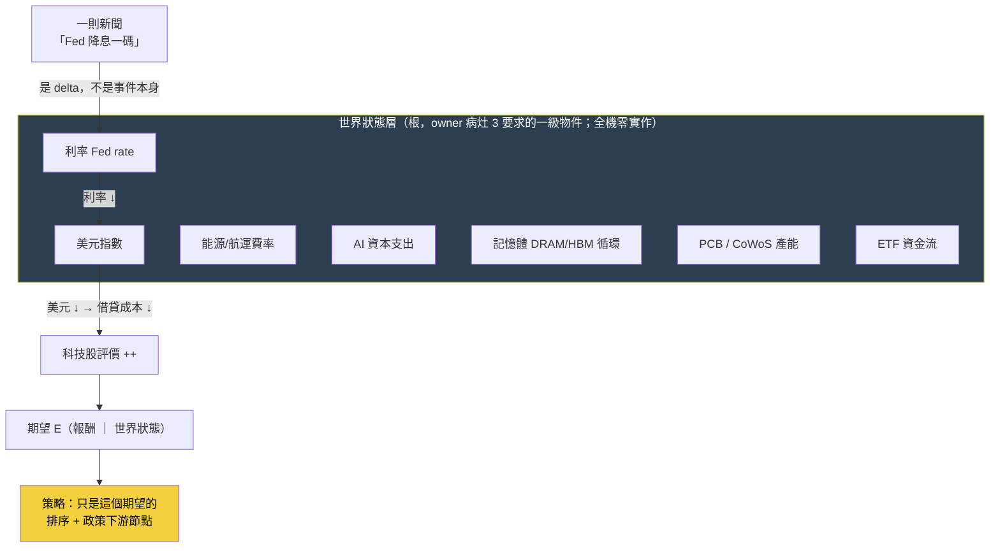

# 世界模型：世界不是新聞，新聞是世界狀態的 delta

這一頁是 owner 深層批評的**病灶 3**。批評很短、但足以掀掉整份 wiki 的敘事主軸：

> 這台引擎把「新聞流」當成世界的樣子——一則一則事件進來、觸發訊號、生成策略。但**世界不是一串新聞**。世界是一組緩慢與快速移動的狀態變數：利率、美元、能源價格、航運費率、AI 資本支出、記憶體（DRAM/HBM）循環、PCB 稼動、CoWoS 產能、ETF 資金流……**一則新聞之所以有意義，是因為它是這些世界狀態的一個 delta（變化量）**。「Fed 降息」不是一個孤立事件，它的意義是：`Fed 利率 ↓ → 美元 ↓ → 借貸成本 ↓ → 科技股評價 ++`。沒有那個世界狀態當背景，這則新聞不可讀。

換句話說，投資判斷的根不是「新聞說了什麼」，而是「世界現在是什麼狀態、這則新聞把哪個狀態變數推向哪裡」。策略只是這個世界狀態的一個下游函數——`E[未來報酬 | 世界狀態]`（見 [進化目標](objective.md)、[總覽](overview.md)的策略本體論）。

## 認知答案與行動答案（先講結論）

- **認知答案**：世界模型（world model）在這台引擎裡**被設計了、但幾乎是空殼、而且擺錯了位階**。它不是「完全沒有」——[世界訊號](fw-world-signal.md)的九態狀態機、[本體論](objective.md)的 `狀態 → 期望` 公式都在描述世界狀態；但世界層的**數值全是示意佔位、沒接任何一條真實的世界狀態序列**，而且整份 wiki 的敘事把「策略基因的進化」當主軸、把世界模型降格成量化語言棧的一個側邊框架。
- **行動答案**：分兩步，且順序不能顛倒。①**現在就重構敘事主軸與進化目標**——把世界模型放回根、策略放回下游節點（便宜且正確，只改敘事與目標函數）；②**建置仍走薄縱切**——先把 **ONE** 條「世界狀態 → 知識 → 假說 → 驗證」的真實機制鏈（如台電強韌電網、CoWoS 產能）從頭填滿，**而不是**把 [Research OS 11 層](research-os.md)的十一個引擎都蓋成空殼。後者正是 [誠實紀律](discipline.md)點名的 architecture-first 致命陷阱。

## 三態誠實對帳：世界模型現在到底存在到什麼程度

owner 說「沒有世界狀態層」——精確講不是完全沒有，是三種狀態混在一起。攤開如下。

### 【已設計】哪些既有頁/框架已經定義了世界狀態的語言

- [世界訊號](fw-world-signal.md)把世界判斷拆成 `WS = D + V + M + A + T + P + E + τ` 的完整地址，其中 **D（Observation）的九種觀測型別**——`Price / Quantity / Capacity / Demand / Competition / Policy / Technology / Finance / Market`——就是「世界狀態變數」的封閉詞彙雛形；輸出是**行情演化九態狀態機**（無衝擊 → 甜蜜點 → 主升段 → 破壞），這是「世界走到哪個階段」的語言。
- [本體論](objective.md)／[總覽](overview.md)把策略定義成 `世界狀態 S → E[未來報酬 | S]`——這條公式本身就把世界狀態立為第一位、策略立為它的期望函數。
- AARO（自治 Alpha 研究實驗室，本專案地基）的 regime 概念（波動 regime 決定順勢/反轉輪動，已真跑 H-R001）是「世界處於哪個狀態」影響策略的既有實例。

### 【幾乎空殼】實際上世界狀態有多少真數據

- **世界訊號的世界層數值是示意佔位**：案例庫 WS001–WS006 用同一個衝擊（華城／台電強韌電網）示範九態，但那些世界層數值是**示範 schema 用的佔位資料，不是即時抓取的真實世界資料**（見 [框架：世界訊號](fw-world-signal.md) 誠實邊界）。引擎機件（狀態機／影響比／預期差／反證／PIT）是真的、可驗證；但世界層**尚未接任何真資料源**。
- **九態不是 owner 講的那個世界狀態**：這裡有一個必須說清楚的位階落差。世界訊號的九態，描述的是「**某個特定衝擊 × 某家公司**」演化到哪——它是**個股行情**的階段機。而 owner 病灶 3 講的世界狀態，是**利率／美元／能源／航運／DRAM／PCB／CoWoS／ETF 這些總體變數本身**當一級物件、每天有值、彼此有傳導。**這一層——把總體世界變數物化成一張「今天世界長什麼樣」的狀態表——全機零實作、連 schema 都還沒定**。九態是「行情對某衝擊的反應」，不是「世界本身的狀態」。
- **沒有任何一張表叫「世界狀態」**：你在整台機器裡找不到一列「2026-07-22：Fed 利率 x%、美元指數 y、BDI 航運 z、HBM 現貨 w、CoWoS 稼動 v」。世界狀態目前只存在於敘事與佔位案例裡，不存在於資料裡。

### 【擺錯位階】wiki 敘事把策略當根、世界模型當側邊

- [首頁](index.md)與 [總覽](overview.md)的敘事線是「策略＝狀態的期望 → 四種語言 → 圖記憶 → **進化引擎生成/否證策略**」——主角是**策略基因（StrategySpec）**，進化迴圈變異的是策略、裁決的是策略的 Sharpe/CAGR。
- 世界模型出現在哪？出現在量化語言棧的**第二層框架**（[框架：世界訊號](fw-world-signal.md)），與特徵代數、持有期並列，是「五層語言之一」，而且資產歸戶總表明講它「**P1 後才進場**」（Gen5 regime 門控才需要）——被排到最後。
- 這正是病灶 3 的核心：**世界模型像側邊功能，不像根**。owner 的重構要求把這個位階倒過來——世界狀態是根，策略是「站在某個世界狀態下、對某群股票的期望」這個下游節點。

## 一張圖看懂：世界狀態當根，新聞是它的 delta

讀法：新聞（「Fed 降息」）不是圖的起點，它是**打在世界狀態變數上的一個 delta**；世界狀態沿傳導鏈改變評價，評價改變條件期望，策略才在最下游依期望排序、套政策。目前這台引擎的實作把箭頭方向搞反了——從新聞直接跳到策略訊號，中間那層深藍色的「世界狀態」是空的。

## 修法：先重構目標，再薄縱切填一條真鏈

病灶 3 的修法不是「趕快把世界狀態表建出來」，那會掉進兩個坑：一是 architecture-first（先蓋空層、日後研究失敗無法歸因到哪層，見 [方法論：誠實紀律（拒絕相信自己）](discipline.md) 第六條）；二是「用想像的邊餵傳播，比沒有邊還毒」（[知識圖譜：四張圖](graph-knowledge.md)第一鐵律）。正確順序是：

1. **敘事與目標先改（便宜且正確）**：把 [進化目標](objective.md)從「子代 Sharpe 勝父代」改成「世界模型的可反證預測力提升／知識缺口收斂」。這件事一行代碼不用動世界狀態表，就能擋掉 [實驗 002](exp-002-ablation.md) 揭露的病——優化策略級指標，只會反覆重新發現動能 beta。
2. **薄縱切填一條真鏈（不蓋 11 個空引擎）**：選 **ONE** 個世界狀態變數當起點（例如「台電強韌電網政策 → 重電設備需求」或「CoWoS 產能循環」），把 `世界狀態 → 知識子圖 → 假說 → PIT 驗證` 這條窄鏈**填滿真數據、每條邊帶證據錨點**，跑完一次前瞻驗證窗。這條薄鏈的知識展開見 [知識層](knowledge-layer.md)，機制傳導見 [因果層](causal-layer.md)，11 層為何不能一次蓋見 [Research OS](research-os.md)。

一句話收束：**世界模型的問題不是「沒做」，是「做成了佔位樣品、還擺在側邊」**。把它搬回根、先填實一條，比把十一層都畫成空圖有價值得多。

延伸閱讀：一則新聞如何展開成知識子圖 → [知識層：一則新聞展開成一張知識子圖](knowledge-layer.md)；世界事件如何沿機制傳導到股價 → [因果層：新聞→事件→供需→公司→財報→預期→價格](causal-layer.md)；為什麼進化目標本身錯了 → [進化的目標設錯了（病灶六）](objective.md)；九態世界訊號的完整設計與誠實邊界 → [框架：世界訊號](fw-world-signal.md)；11 層重構為何要走薄縱切 → [研究作業系統：11 層與「別蓋空引擎」](research-os.md)。

---

**被連結自（反向連結）：** [假說引擎：從「今天有哪些新聞」到「今天最大的未知是什麼」](hypothesis-engine.md) · [因果層：新聞→事件→供需→公司→財報→預期→價格](causal-layer.md) · [整體架構與資料流](architecture.md) · [方法論：誠實紀律（拒絕相信自己）](discipline.md) · [知識層：一則新聞展開成一張知識子圖](knowledge-layer.md) · [研究作業系統：11 層與「別蓋空引擎」](research-os.md) · [研究迴圈：世界→知識→假說→驗證→更新世界模型](research-loop.md) · [給 LLM 評審：請攻擊這些接縫](for-llm-review.md) · [總覽：真正該演化的不是策略，是世界模型](overview.md) · [進化的目標設錯了（病灶六）](objective.md) · [首頁：Alpha 進化迴圈研究 Wiki](index.md)
