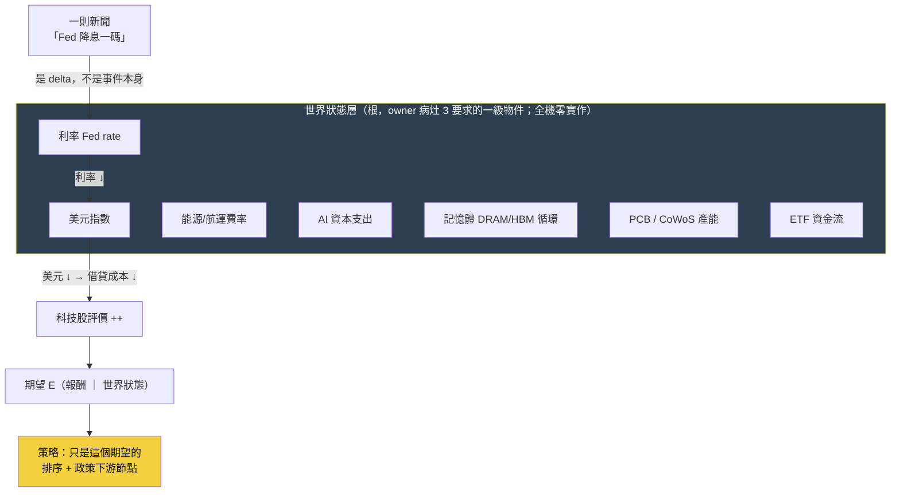
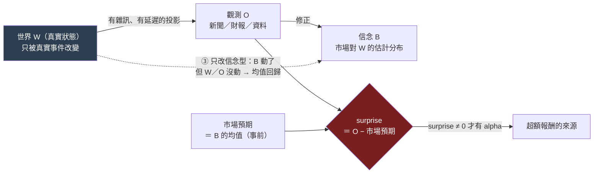

# 世界模型：世界不是新聞，新聞是世界狀態的 delta

這一頁是 owner 深層批評的**病灶 3**。批評很短、但足以掀掉整份 wiki 的敘事主軸：

> 這台引擎把「新聞流」當成世界的樣子——一則一則事件進來、觸發訊號、生成策略。但**世界不是一串新聞**。世界是一組緩慢與快速移動的狀態變數：利率、美元、能源價格、航運費率、AI 資本支出、記憶體（DRAM/HBM）循環、PCB 稼動、CoWoS 產能、ETF 資金流……**一則新聞之所以有意義，是因為它是這些世界狀態的一個 delta（變化量）**。「Fed 降息」不是一個孤立事件，它的意義是：`Fed 利率 ↓ → 美元 ↓ → 借貸成本 ↓ → 科技股評價 ++`。沒有那個世界狀態當背景，這則新聞不可讀。

換句話說，投資判斷的根不是「新聞說了什麼」，而是「世界現在是什麼狀態、這則新聞把哪個狀態變數推向哪裡」。策略只是這個世界狀態的一個下游函數——`E[未來報酬 | 世界狀態]`（見 [[objective|進化目標]]、[[overview|總覽]]的策略本體論）。

## 認知答案與行動答案（先講結論）

- **認知答案**：世界模型（world model）在這台引擎裡**被設計了、但幾乎是空殼、而且擺錯了位階**。它不是「完全沒有」——[[fw-world-signal|世界訊號]]的九態狀態機、[[objective|本體論]]的 `狀態 → 期望` 公式都在描述世界狀態；但世界層的**數值全是示意佔位、沒接任何一條真實的世界狀態序列**，而且整份 wiki 的敘事把「策略基因的進化」當主軸、把世界模型降格成量化語言棧的一個側邊框架。
- **行動答案**：分兩步，且順序不能顛倒。①**現在就重構敘事主軸與進化目標**——把世界模型放回根、策略放回下游節點（便宜且正確，只改敘事與目標函數）；②**建置仍走薄縱切**——先把 **ONE** 條「世界狀態 → 知識 → 假說 → 驗證」的真實機制鏈（如台電強韌電網、CoWoS 產能）從頭填滿，**而不是**把 [[research-os|Research OS 11 層]]的十一個引擎都蓋成空殼。後者正是 [[discipline|誠實紀律]]點名的 architecture-first 致命陷阱。

## 三態誠實對帳：世界模型現在到底存在到什麼程度

owner 說「沒有世界狀態層」——精確講不是完全沒有，是三種狀態混在一起。攤開如下。

### 【已設計】哪些既有頁/框架已經定義了世界狀態的語言

- [[fw-world-signal|世界訊號]]把世界判斷拆成 `WS = D + V + M + A + T + P + E + τ` 的完整地址，其中 **D（Observation）的九種觀測型別**——`Price / Quantity / Capacity / Demand / Competition / Policy / Technology / Finance / Market`——就是「世界狀態變數」的封閉詞彙雛形；輸出是**行情演化九態狀態機**（無衝擊 → 甜蜜點 → 主升段 → 破壞），這是「世界走到哪個階段」的語言。
- [[objective|本體論]]／[[overview|總覽]]把策略定義成 `世界狀態 S → E[未來報酬 | S]`——這條公式本身就把世界狀態立為第一位、策略立為它的期望函數。
- AARO（自治 Alpha 研究實驗室，本專案地基）的 regime 概念（波動 regime 決定順勢/反轉輪動，已真跑 H-R001）是「世界處於哪個狀態」影響策略的既有實例。

### 【幾乎空殼】實際上世界狀態有多少真數據

- **世界訊號的世界層數值是示意佔位**：案例庫 WS001–WS006 用同一個衝擊（華城／台電強韌電網）示範九態，但那些世界層數值是**示範 schema 用的佔位資料，不是即時抓取的真實世界資料**（見 [[fw-world-signal]] 誠實邊界）。引擎機件（狀態機／影響比／預期差／反證／PIT）是真的、可驗證；但世界層**尚未接任何真資料源**。
- **九態不是 owner 講的那個世界狀態**：這裡有一個必須說清楚的位階落差。世界訊號的九態，描述的是「**某個特定衝擊 × 某家公司**」演化到哪——它是**個股行情**的階段機。而 owner 病灶 3 講的世界狀態，是**利率／美元／能源／航運／DRAM／PCB／CoWoS／ETF 這些總體變數本身**當一級物件、每天有值、彼此有傳導。**這一層——把總體世界變數物化成一張「今天世界長什麼樣」的狀態表——全機零實作、連 schema 都還沒定**。九態是「行情對某衝擊的反應」，不是「世界本身的狀態」。
- **沒有任何一張表叫「世界狀態」**：你在整台機器裡找不到一列「2026-07-22：Fed 利率 x%、美元指數 y、BDI 航運 z、HBM 現貨 w、CoWoS 稼動 v」。世界狀態目前只存在於敘事與佔位案例裡，不存在於資料裡。

### 【擺錯位階】wiki 敘事把策略當根、世界模型當側邊

- [[index|首頁]]與 [[overview|總覽]]的敘事線是「策略＝狀態的期望 → 四種語言 → 圖記憶 → **進化引擎生成/否證策略**」——主角是**策略基因（StrategySpec）**，進化迴圈變異的是策略、裁決的是策略的 Sharpe/CAGR。
- 世界模型出現在哪？出現在量化語言棧的**第二層框架**（[[fw-world-signal]]），與特徵代數、持有期並列，是「五層語言之一」，而且資產歸戶總表明講它「**P1 後才進場**」（Gen5 regime 門控才需要）——被排到最後。
- 這正是病灶 3 的核心：**世界模型像側邊功能，不像根**。owner 的重構要求把這個位階倒過來——世界狀態是根，策略是「站在某個世界狀態下、對某群股票的期望」這個下游節點。

## 一張圖看懂：世界狀態當根，新聞是它的 delta

讀法：新聞（「Fed 降息」）不是圖的起點，它是**打在世界狀態變數上的一個 delta**；世界狀態沿傳導鏈改變評價，評價改變條件期望，策略才在最下游依期望排序、套政策。目前這台引擎的實作把箭頭方向搞反了——從新聞直接跳到策略訊號，中間那層深藍色的「世界狀態」是空的。

## 病灶 3 的第二層（owner 第二輪）：世界 W、觀測 O、信念 B 要乾淨分開

上面那張圖有一個藏起來的粗糙處，owner 第二輪批評把它挑出來：圖把新聞畫成「打在世界狀態上的一個 delta」，好像世界狀態會被新聞直接改寫。但這其實把**三種完全不同的東西**壓成了一種。要把世界模型做對，得先把三層乾淨分開：

- **世界 W（World state）**：市場真正的狀態——利率、產能、庫存、供需。它**只被真實事件改變，不會被一則報導「更新」**。台積電產能是多少就是多少，不因為某家媒體報導而改變。
- **觀測 O（Observation）**：我們透過資料／新聞／財報**看到的 W 的一角**。O 永遠是 W 的有雜訊、有延遲、不完整的投影。
- **信念 B（Belief）**：市場（與我們的模型）對 W 的**估計分布**。**投資裡真正被更新的，永遠是 B，不是 W。** 一則新聞的作用，是透過 O 去修正 B——世界本身不會因為你讀了新聞而改變。

把這三者分開之後，「一則新聞是什麼」就不再是單一答案，而是**三型**——而且每一型對投資的意義完全不同：

| 新聞型別 | 它改變了什麼 | 例子 | 對 B（信念）的作用 |
|---|---|---|---|
| ① 改變世界狀態 | 真的動了 W | Fed 真的降息一碼、廠房火災燒掉產能 | W 變了 → 理性的 B 應隨之更新 |
| ② 揭露既有狀態 | W 沒動，只是把早已存在的 W 揭露給 O | 財報公布上季「已經發生」的營收、法說會證實傳聞 | W 不變，但 O 讓 B 從偏誤收斂向真實 W |
| ③ 只改市場信念 | W、O 都沒真的變，只有情緒／敘事移動 B | 分析師喊目標價、無新資訊的媒體渲染 | B 動了但沒有 W 支撐 → 常是均值回歸的來源 |

**為什麼這個區分是投資的命脈**：因為賺錢的不是「新聞好不好」，是 **surprise（意外）＝ 新觀測 O − 市場預期（B 的均值）**。同一則「營收成長 30%」，若市場本來就預期 30%，surprise＝0、不該有超額報酬；若市場只預期 10%，surprise＝＋20%、才有 alpha。第①②型在 surprise 為正時提供真訊號，第③型的 surprise 常是假的（沒有 O 支撐），事後回吐。**一個把三型混為一談的系統，會把第③型的雜訊當成第①型的訊號去下注。**

### 這一層系統已經有一半：world-signal 的 P（預期差）

要誠實對帳：surprise 這個概念，[[fw-world-signal|世界訊號]] 的 **P 欄（Pricing/Expectation）已經部分做出來了**——它的 `預期差 = 研究估計增量利益 − 市場隱含` 正是 surprise 的一個具體實例；九態狀態機裡 `CAPTURE_CONFIRMED_EXPECTATION_GAP`（有預期差＝甜蜜點）與 `CAPTURE_CONFIRMED_ALREADY_PRICED`（已定價＝ surprise 已耗盡）也正是「surprise 還在不在」的語言。所以這不是全新發明，是把既有的 P 欄升格成整套世界模型的骨架。

**缺的不是 surprise 的概念，是 W／O／B 的乾淨分離。** 現在的引擎沒有一個地方把「世界真實狀態 W」「我們的觀測 O」「市場信念 B」當成三個分開、有型別的物件來記帳——P 預期差是算出來的一個數，但它背後的 B（市場信念的完整分布、它從哪一版更新到哪一版、因哪份 O）沒有被獨立、可追溯地存下來。這正是 [[world-belief-contract|信念契約]] 要補的洞：把每一條信念 B 寫成可版本化、可對帳、可被 O 推翻的契約，讓「哪條信念、因哪份證據、從哪版更新到哪版」有逐欄的答案。exp-004 已經用真資料跑通一次（信念 B-H-003：86 筆對帳 27 命中 → 信心從 0.5 更新到 0.2256、判 REFUTE），見 [[exp-004-belief-contract|實驗 004]]。

這一層的信念更新迴圈，就是 [[three-loops|三迴圈]] 裡的**認知迴圈**（改世界模型，裁判＝預測校準／樣本外 log score／反證）；它跟決策迴圈（改策略）、元研究迴圈（改怎麼選問題）分開結算——避免第一版「只演化世界模型」把策略當可有可無投影的矯枉過正。owner 第二輪講得直接：策略不是投影，是「**世界信念進入現實約束後的決策政策**」，本身要被單獨演化與裁決。

## 修法：先重構目標，再薄縱切填一條真鏈

病灶 3 的修法不是「趕快把世界狀態表建出來」，那會掉進兩個坑：一是 architecture-first（先蓋空層、日後研究失敗無法歸因到哪層，見 [[discipline]] 第六條）；二是「用想像的邊餵傳播，比沒有邊還毒」（[[graph-knowledge]]第一鐵律）。正確順序是：

1. **敘事與目標先改（便宜且正確）**：把單一適應度（[[objective|進化目標]]的「子代 Sharpe 勝父代」）拆成 [[three-loops|三個分開裁決的迴圈]]——認知迴圈用預測校準／樣本外 log score 演化世界模型 B，決策迴圈用 beta 中性後增量演化策略，元研究迴圈用 `ResearchValue` 選題（取代會被鑽漏洞的「知識缺口收斂」）。這件事一行代碼不用動世界狀態表，就能收束 [[exp-002-ablation|實驗 002]] 提供的證據——**現行目標函數存在一條動能捷徑**（注意：這是「這個目標 × 這段樣本」的實驗證據，不是「所有策略演化必收斂到 beta」的全稱結論）。
2. **薄縱切填一條真鏈（不蓋 11 個空引擎）**：選 **ONE** 個世界狀態變數當起點（例如「台電強韌電網政策 → 重電設備需求」或「CoWoS 產能循環」），把 `世界狀態 → 知識子圖 → 假說 → PIT 驗證` 這條窄鏈**填滿真數據、每條邊帶證據錨點**，跑完一次前瞻驗證窗。這條薄鏈的知識展開見 [[knowledge-layer|知識層]]，機制傳導見 [[causal-layer|因果層]]，11 層為何不能一次蓋見 [[research-os|Research OS]]。

一句話收束：**世界模型的問題不是「沒做」，是「做成了佔位樣品、還擺在側邊」**。把它搬回根、先填實一條，比把十一層都畫成空圖有價值得多。

延伸閱讀：一則新聞如何展開成知識子圖 → [[knowledge-layer]]；世界事件如何沿機制傳導到股價 → [[causal-layer]]；為什麼進化目標本身錯了 → [[objective]]；九態世界訊號的完整設計與誠實邊界 → [[fw-world-signal]]；11 層重構為何要走薄縱切 → [[research-os]]。
